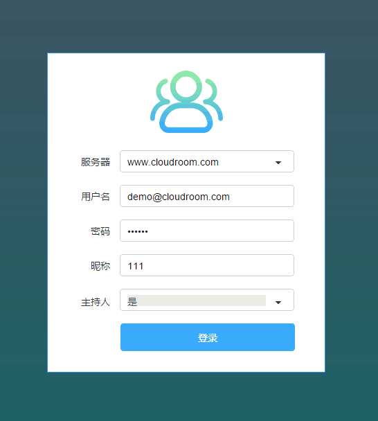
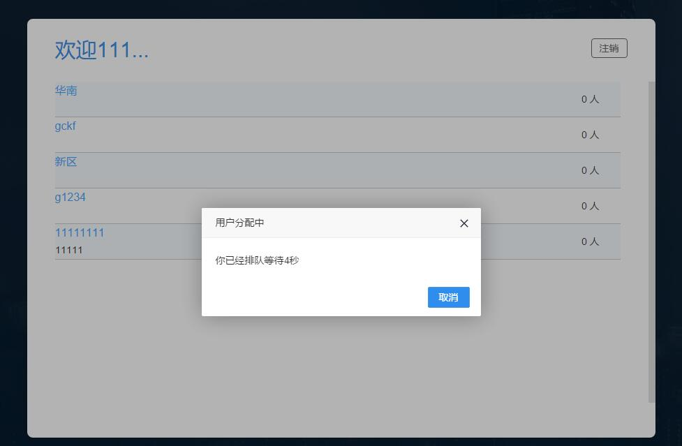
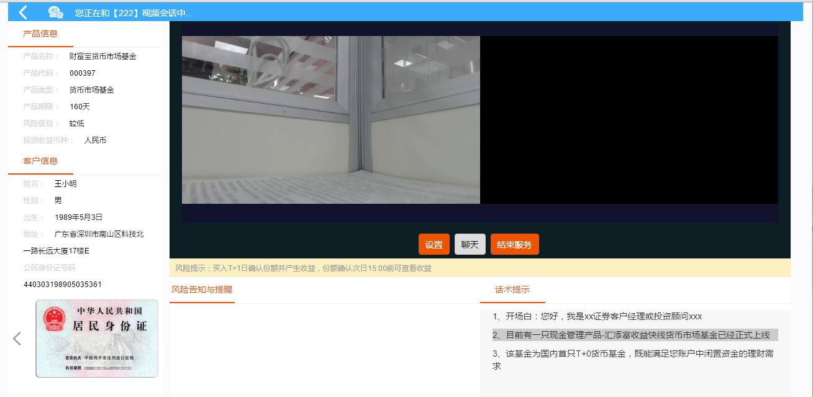
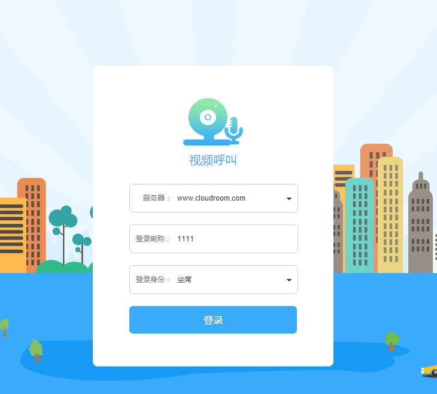

# Demo程序介绍 {#demo}

> Examples 目录下Demo程序配置和功能简介。

----

## 视频会议 {#Meeting}

> JavaScript编写，主要实现了透明传输，创建进入视频会议，用会议号进入视频会议，会议内视频墙、屏幕共享、音视频设置、IM聊天。

* 关闭所有浏览器点击[安装SDK](Explain.md#install)，然后打开Examples 目录下面的Meeting(web)->index.html

* 输入服务器地址和用户ID，登录

* 输入会议主题，创建并进入会议

* 进入视频会议主界面

* 第三方进入会议，输入会议号进入

## 本地双录 {#Double}

> JavaScript编写，主要实现本地入会，创建会议，进入会议，会议内录制、上传录制、音视频设置、视频播放、单双摄像头选择。

* 关闭所有浏览器点击[安装SDK](Explain.md#install)，然后打开Examples 目录下面的RecordDemo(web)->index.html

* 输入服务器地址和用户ID，登录

* 点击选择创建并进入会议

* 进入本地双录主界面

## 远程双录 {#RemoteDoubleRecord}

> JavaScript编写，主要了利用队列系统进行用户分配，然后呼叫分到的用户，双方进入同一个远程会话，创建会议，进入会议，会议内录制、pcm文件录制、上传录制、音视频设置、视频播放、屏幕共享、IM聊天。

* 关闭所有浏览器点击[安装SDK](Explain.md#install)，然后打开Examples 目录下面的RemoteRecordDemo(web)->index.html

* 输入服务器地址和用户ID，登录(坐席)

* 点击开启服务器。等待连接(坐席)

* 输入服务器地址和用户ID，登录(客户)

* 点击连接服务器(客户)

* 等待排队(客户)

* 进入远程双录主界面(坐席)

* 进入远程双录主界面(客户)

## 视频呼叫 {#videocall}

> JavaScript编写，主要了利用队列系统进行用户分配，然后呼叫分到的用户，双方进入同一个视频会话，创建视频，进入视频，视频内录制、音视频设置、发送文件、截图。

* 关闭所有浏览器点击[安装SDK](Explain.md#install)，然后打开Examples 目录下面的VideoCall(web)->index.html

* 输入服务器地址和用户ID，登录(坐席)

* 点击开启服务器。等待连接(坐席)

* 输入服务器地址和用户ID，登录(客户)

* 点击连接服务器(客户)

* 等待排队(客户)

* 进入远程双录主界面(坐席)

* 进入远程双录主界面(客户)

