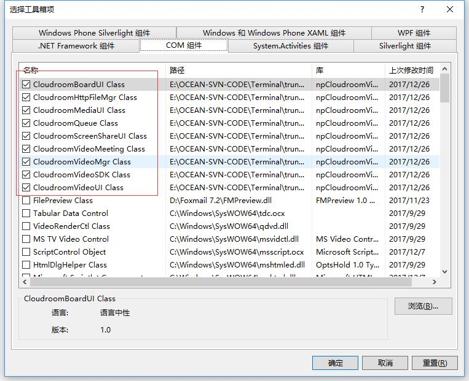
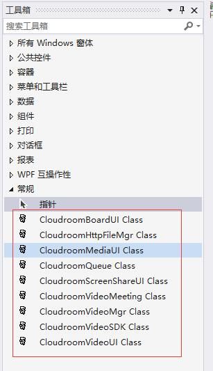
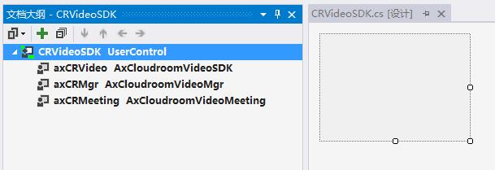
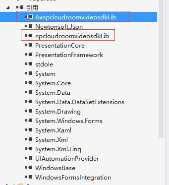
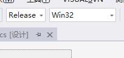

# 云屋视频SDK参考 {#index}

> Active X插件方式，适合各种Windows客户端开发语言集成。

    此文档适用v3.8系列版本的SDK    
-----

## 说明 {#reference}

> SDK的安装、开发配置和组件介绍。

### SDK安装 {#install}

SDK开发包内容说明：
>     |——readme.txt          sdk包说明文件
>     |——doc                 开发手册、版本历史文件目录
>     |——bin                 sdk及依赖的文件目录
>     |——setup               打包bin目录下的文件形成的安装包
>     |——examples            演示程序

运行setup/CloudroomSDK.exe，如果提示要求管理员权限，请选择[允许]。


### 运行环境要求 {#runEvn}

> * Windows XP (SP2)及以后版本的系统

### 开发环境配置 {#developEvn}

适合各种windows桌面客户端开发平台, 如 VC, C#, VB, Qt, C++ Builder, Delphi……

> 以Visual Studio 2008 C# 开发为例
> * 添加组件到Visual Studio工具箱




> * 拖拽组件到自己项目内的窗体上


>> 打开[引用]，检查组件是否引入成功（如下图）



* 选择解决方案配置[Release]、平台[Win32] 或 [x86]



* 命名引入工程内的SDK组件对象，并访问接口和回调函数

```cs
//crvideosdk.cs
using AxnpcloudroomvideosdkLib;
namespace Meeting_WPF
{
    public partial class CRVideoSDK : UserControl
    {
        public AxCloudroomVideoSDK VideoSDK
        {
            get { return axCRVideo; }
        }
        public AxCloudroomVideoMeeting Meeting
        {
            get { return axCRMeeting; }
        }
        public AxCloudroomVideoMgr Mgr
        {
            get { return axCRMgr; }
        }
    }
}

//login.cs
using AxnpcloudroomvideosdkLib;
namespace Meeting_WPF
{
    public partial class Login : Window
    {
        public CRVideoSDK CRVideo = new CRVideoSDK();
        private void initMeeting()
        {
            CRVideo.VideoSDK.init(Environment.CurrentDirectory);
        }
        private void login()
        {
          CRVideo.Mgr.login("demo@cloudroom.com", "e10adc3949ba59abbe56e057f20f883e", "Tom", "user000001", "", "");
        }
        private void initDelegate()
        {
            CRVideo.Mgr.loginSuccess += new AxnpcloudroomvideosdkLib.ICloudroomVideoMgrEvents_loginSuccessEventHandler(loginSuccess);
            CRVideo.Mgr.loginFail += new AxnpcloudroomvideosdkLib.ICloudroomVideoMgrEvents_loginFailEventHandler(loginFailed);
        }
    }
}
```

### 主要组件 {#mainClass}

> SDK是由众多的DLL组件组合而成的，对外提供以下几个组件：

* [基础组件 CloudroomVideoSDK](#CloudroomVideoSDK)
* [管理组件 CloudroomVideoMgr](#CloudroomVideoMgr)
* [队列组件 CloudroomQueue](#CloudroomQueue)
* [Http文件管理组件 CloudroomHttpFileMgr](#CloudroomHttpFileMgr)
* [视频会议组件 CloudroomVideoMeeting](#CloudroomVideoMeeting)
  * [视频显示组件 CloudroomVideoUI](#CloudroomVideoUI)
  * [屏幕共享画面显示组件 CloudroomScreenShareUI](#CloudroomScreenShareUI)
  * [影音显示组件 CloudroomMediaUI](#CloudroomMediaUI)
  * [白板显示组件 CloudroomBoardUI](#CloudroomBoardUI)

#### 基础组件CloudroomVideoSDK {#CloudroomVideoSDK}

    CLSID: {07EFD662-A1BB-4d8d-9BEE-F7E43E5FEBF5}
    ProgID: npCloudroomVideoSDK.CloudroomVideoSDK
    MIME TYPE: application/x-cloudroom-videosdk

CloudroomVideoSDK是基础组件，是整个SDK使用的基础。

该组件一个进程内只能创建一个实例，直到应用退出时才反初始化并销毁。

组件使用过程主要包括：

    1. 创建组件实例
    2. 执行初始化
    3. 程序退出时执行反初始化

#### 管理组件CloudroomVideoMgr {#CloudroomVideoMgr}

    CLSID: {120AD2B0-68F2-46c6-88D8-52173F501C0F}
    ProgID: npCloudroomVideoSDK.CloudroomVideoMgr
    MIME TYPE: application/x-cloudroom-videomgr

CloudroomVideoMgr是登录、呼叫、会议创建管理和透明传输类。

该组件一个进程内只能创建一个实例，实现了入会前的相关功能。

组件使用过程主要包括：

    1. 创建组件实例
    2. 登录
    3. 创建会议

注意: 只有在CloudroomVideoSDK Init初始化成功后接口才可用。

#### 队列组件CloudroomQueue {#CloudroomQueue}

    CLSID: {9AAD199D-A02F-4513-875D-AA81091E44B9}
    ProgID: npCloudroomVideoSDK.CloudroomQueue
    MIME TYPE: application/x-cloudroom-queue

CloudroomQueue是队列组件，它实现队列功能。

该组件一个进程内只能创建一个实例，是可选组件，用于用户分发，您可以使用它，也可以自已另外实现，这并不影响视频呼叫、音视频通话功能。

组件使用过程主要包括：

    1. 创建组件实例，执行初始化
    2. 队列获取，客户排队/座席服务

注意：只有在CloudroomVideoMgr登录成功后接口才可用。

#### Http文件管理组件CloudroomHttpFileMgr {#CloudroomHttpFileMgr}

    CLSID: {7E44F8C9-7C8D-4004-8F45-D9819D78663C}
    ProgID: npCloudroomVideoSDK.CloudroomHttpFileMgr
    MIME: application/x-cloudroom-httpfilemgr

CloudroomHttpFileMgr是Http文件上传下载及文件管理类。

该组件一个进程内只能创建一个实例，主要应用于单方文件归档，单方文件下载，支持非云屋http服务器对接。

如果会议内临时文件共享，请使用CloudroomVideoMeeting中的会议网盘功能。

下载支持断点续传，上传暂不支持断点机制。

注意：只有在CloudroomVideoSDK初始化后接口才可用。

#### 视频会议组件CloudroomVideoMeeting {#CloudroomVideoMeeting}

    CLSID: {9E9DD983-A9F8-4dff-B694-B1AE1C708B1E}
    ProgID: npCloudroomVideoSDK.CloudroomVideoMeeting
    MIME TYPE: application/x-cloudroom-videomeeting

CloudroomVideoMeeting是视频会议类。

该组件一个进程内只能创建一个实例，包含了视频会话相关的全部功能。

组件使用过程主要包括：

    1. 创建组件实例
    2. 进入会议
    3. 会议内的各功能处理
    4. 退出会议

注意：只有在CloudroomVideoSDK Init初始化成功后接口才可用。

进入视频会议可用以下组件：

##### 视频显示组件CloudroomVideoUI {#CloudroomVideoUI}

    CLSID: {8A6BBBDC-C6BE-4a47-92F3-F9581C3FB95E}
    ProgID: npCloudroomVideoSDK.CloudroomVideoUI
    MIME: application/x-cloudroom-videoui

CloudroomVideoUI是视频显示组件，它显示设定的用户的视频。

该组件可以创建多个实例，然后分别配置大小、位置并设置要显示的用户ID和摄像头ID即可。

注意：只有在CloudroomVideoMeeting入会成功后才能正常工作。

##### 屏幕共享画面显示组件CloudroomScreenShareUI {#CloudroomScreenShareUI}

    CLSID: {6FF142C5-8A36-49d7-B627-D60B803550FC}
    ProgID: npCloudroomVideoSDK.CloudroomScreenShareUI
    MIME: application/x-cloudroom-screenshareui

  CloudroomScreenShareUI是屏幕共享显示组件，它用于显示会议内对方共享的屏幕图像。

  该组件一个进程内只能创建一个实例，整个程序只能创建一个CloudroomScreenShareUI对象，用来接受显示他人开启共享后传过来的画面, 开启共享的接口是CloudroomVideoMeeting中的接口[startScreenShare](meeting.md#startScreenShare)。

  注意：只有在CloudroomVideoMeeting入会成功后才能正常工作。

##### 影音显示组件CloudroomMediaUI {#CloudroomMediaUI}

    CLSID: {93A618D5-2535-42d0-B72B-95705263F398}
    ProgID: npCloudroomVideoSDK.CloudroomMediaUI
    MIME: application/x-cloudroom-mediaui

CloudroomMediaUI是影音显示组件，它用于显示自己或者对方会议内播放的影音图像和声音。

该组件一个进程内只能创建一个实例，整个程序只能创建一个CloudroomMediaUI对象，影音控制接口由CloudroomVideoMeeting统一提供。

注意：只有在CloudroomVideoMeeting入会成功后才能正常工作。

##### 白板显示组件CloudroomBoardUI {#CloudroomBoardUI}

    CLSID: {D9ED4651-4461-458a-99F4-A455977582FF}
    ProgID: npCloudroomVideoSDK.CloudroomBoardUI
    MIME: application/x-cloudroom-boardui

CloudroomBoardUI是白板显示组件，用于显示会议内自己或他人创建的白板。

该组件一个进程内只能创建一个实例，整个程序只能创建一个CloudroomBoardUI对象，也可以不使用此组件，然后用CloudroomVideoMeeting内白板相关的接口实现个性化的白板功能。

[回到索引](#mainClass)