# Demo程序介绍 {#demo}

> Examples 目录下Demo程序配置和功能简介。

----

## 视频会议 {#Meeting}

> C# WPF编写，主要实现了透明传输，创建进入视频会议，用会议号进入视频会议，会议内视频墙、屏幕共享、电子白板、音视频设置、IM聊天、文件共享等功能。

* [安装SDK](README.md#install)，然后用Visual Studio 2008(或更高版本)打开SDK开发包内项目文件

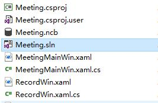

* 选择解决方案配置、平台

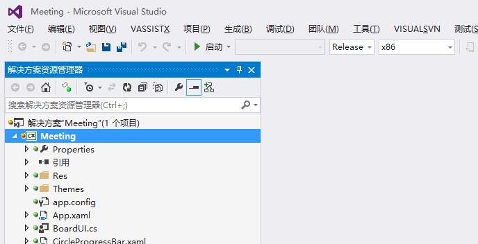

* 输入服务器地址和用户ID，登录

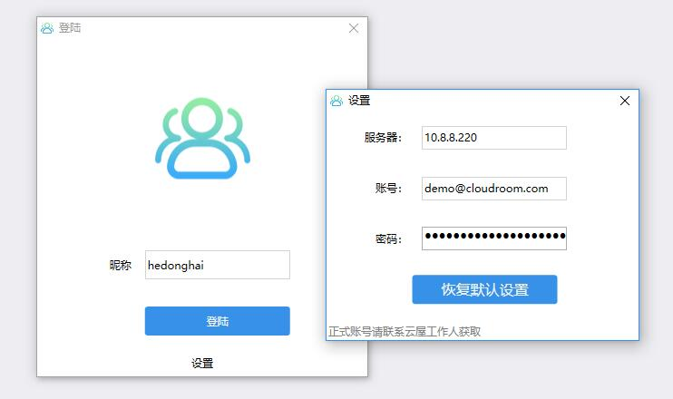

* 输入会议主题，创建并进入会议

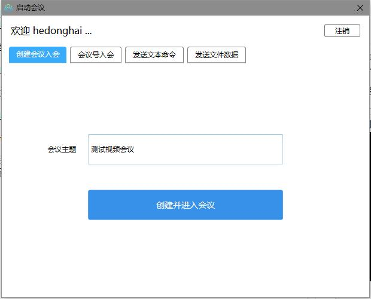

* 进入视频会议主界面

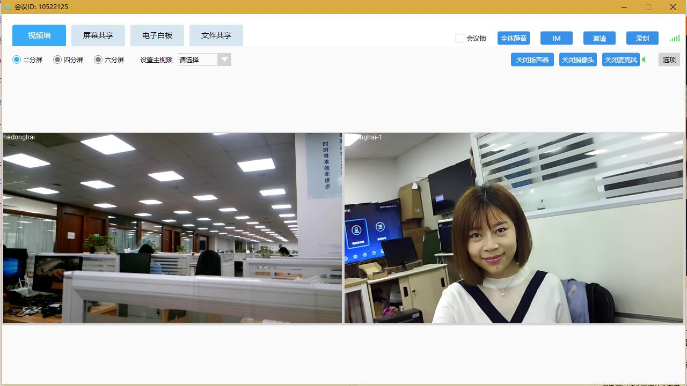

## 队列呼叫 {#VideoCall}

> C# WPF编写，主要实现了利用队列系统进行用户分配，然后呼叫分到的用户，双方进入同一个视频会话中等功能。

* [安装SDK](README.md#install)，然后用Visual Studio 2008(或更高版本)打开SDK开发包内项目文件

* 选择解决方案配置、平台

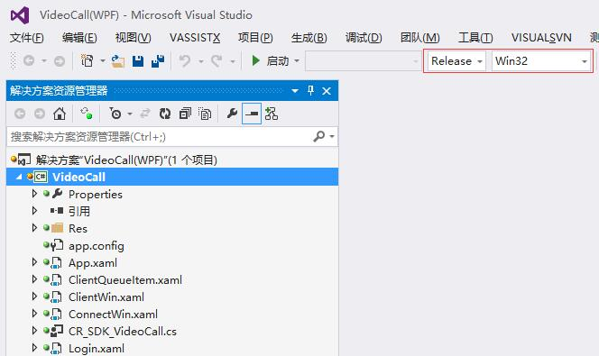

* 编译后在两台机器上分别运行，输入服务器地址（可以是自建服务器地址，也可以使用云屋公有地址）, 选择角色，登录

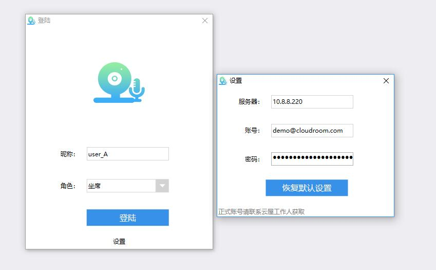
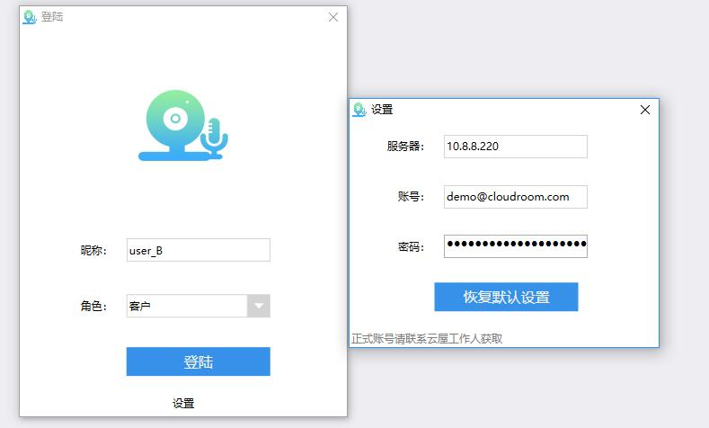

* 进入队列主界面，坐席可同时开始服务若干队列，客户每次则只能选择一个队列进行排队

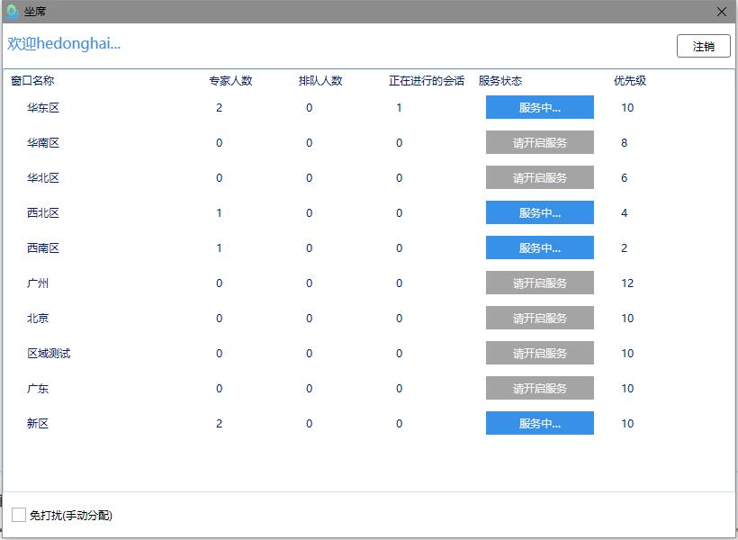
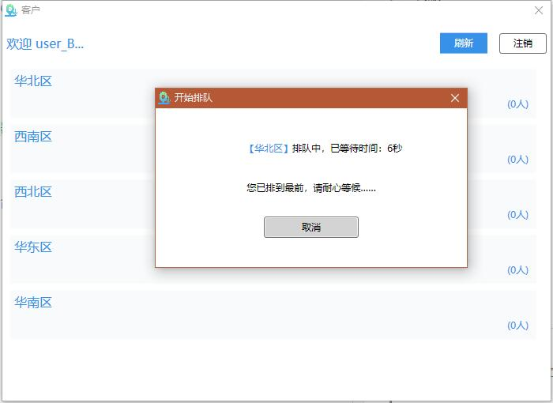

* 坐席收到队列系统分配的排队用户

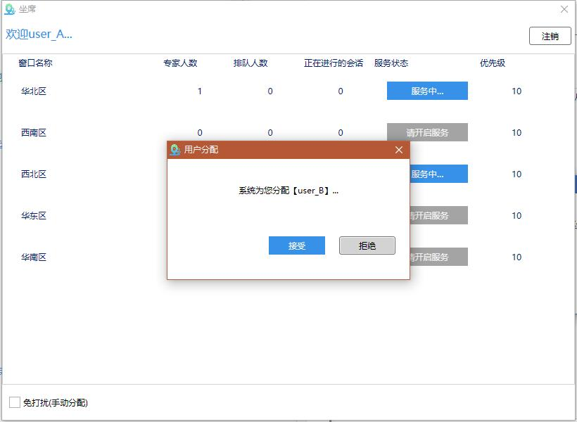

* 接受分配的用户即可进入视频会话中

## 金融合规双录 {#RecordDemo}

> C++ Qt编写，主要实现了录制本地音视频并上传等功能。

* [安装SDK](README.md#install)，然后用Visual Studio 2008(或更高版本)打开SDK开发包内项目文件

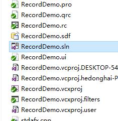

* 解决方案配置和平台

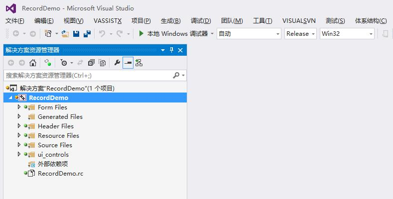

* 编译运行，输入服务器地址（可以是自建服务器地址，也可以使用云屋公有地址）

* 登录，进入程序主界面

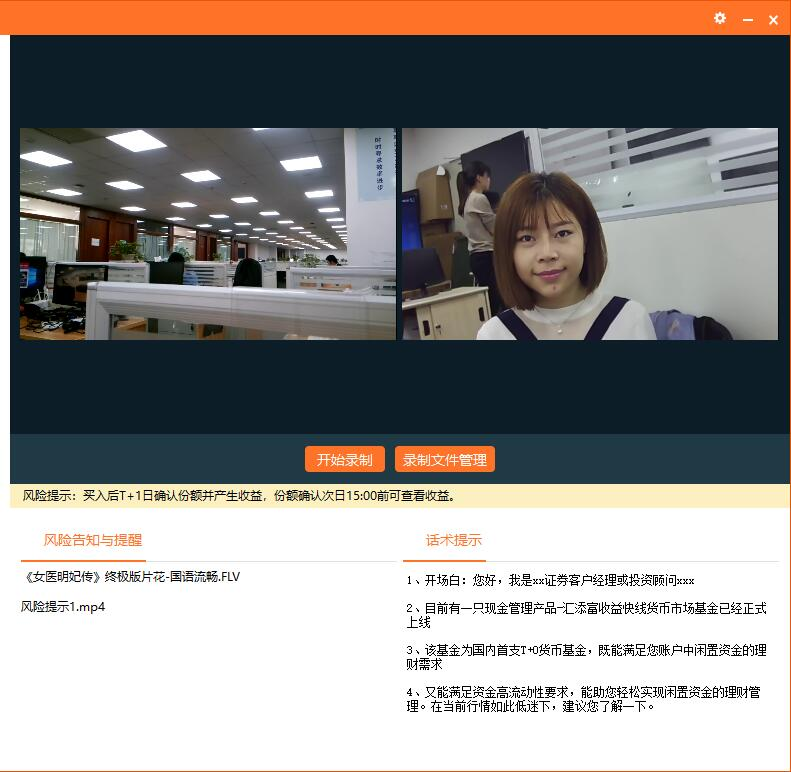