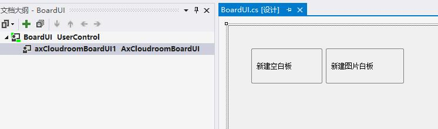
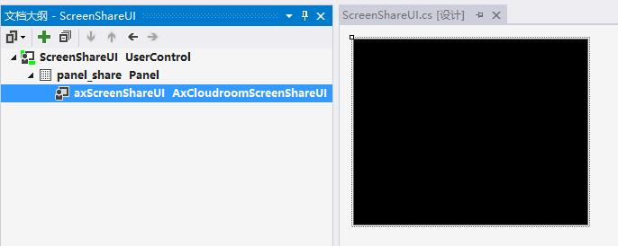

# SDK 集成指南 {#guide}

> 为开发者集成音视频会话及相关高级功能提供相关指导，以下均为C# (伪)代码，详细代码请参考Examples目录下Demo源代码。

    文档中“会议”和“会话”含义等同。

---------------------

## 开始音视频会话 {#startMeeting}

> 快速创建并进入一个简单的音视频会话；
>
> 请先准备[说明]中的相关内容：1.[安装视频SDK插件](README.md#install), 2.[运行环境要求](README.md#runEvn), 3.[开发环境配置](README.md#developEvn)以及连接相关的麦克风摄像头并确认设备工作正常。

基本步骤如下：

1. [初始化SDK](#init)
1. [登录连接视频服务器](#login)
1. [创建视频会话](#create)
1. [进入会话](#enter)
1. [打开麦克风/摄像头](#audio)
1. [有其他人进入会话](#userEnter)
1. [退出会话](#exit)
1. [注销登陆](#logout)

### 1.初始化SDK {#init}

> 初始化是整个SDK的使用基础，通常在程序启动的时候进行初始化([init](cloudroomsdk.md#init))，退出的时候进行反初始化([uninit](cloudroomsdk.md#init))，整个程序的生命周期中只进行一次初始化和反初始化。
>
> 相关API参考请见 [初始化/反初始化](cloudroomsdk.md#init)

    SDK内部的组件多为单例组件，整个程序中只能有一个实例，比如“基础组件”，“会议管理组件”，“视频会议组件”，具体请参见各个组件说明。

```cs
//引入并封装相关的SDK组件
//CR_SDK_VideoCall.cs
using AxnpcloudroomvideosdkLib;
namespace VideoCall
{
    //本类封装的组件为单例组件，为整个程序提供SDK相关的操作
    public partial class CR_SDK_VideoCall : UserControl
    {
        public CR_SDK_VideoCall()
        {
            InitializeComponent();
        }
        //SDK基础组件
        public AxCloudroomVideoSDK Video
        {
            get { return axCRVideoSDK; }
        }
        //会话管理组件
        public AxCloudroomVideoMgr Mgr
        {
            get { return axCRMgr;  }
        }
        //视频会议组件
        public AxCloudroomVideoMeeting Meeting
        {
            get { return axCRMeeting; }
        }
    }
}
```

```cs
//登录类
// login.cs
using AxnpcloudroomvideosdkLib;
namespace VideoCall
{
    public partial class Login : Window
    {
        //登录界面使用单例模式
        private static Login instance = null;
        //CRVideo内部封装了SDK相关的单例组件
        public CR_SDK_VideoCall CRVideo = new CR_SDK_VideoCall();
        public Login()
        {
            //初始化，传入sdk工作目录，注意目录的写权限问题
            CRVideo.Video.init(Environment.CurrentDirectory);
            //关联SDK的通知和回调函数
            initDelegate();
        }
        public static Login Instance
        {
            get
            {
                if (instance == null)
                {
                    instance = new Login();
                }
                return instance;
            }
        }
        private void initDelegate() //注意委托的连接和释放，重复连接委托会造成重复收到消息
        {
            //登录视频服务器结果
            CRVideo.Mgr.loginSuccess += new ICloudroomVideoMgrEvents_loginSuccessEventHandler(loginSuccess);
            CRVideo.Mgr.loginFail += new ICloudroomVideoMgrEvents_loginFailEventHandler(loginFailed);
            //收掉掉线通知后进行掉线处理
            CRVideo.Mgr.lineOff += new ICloudroomVideoMgrEvents_lineOffEventHandler(lineOff);
            //创建视频会议
            CRVideo.Mgr.createMeetingSuccess += new ICloudroomVideoMgrEvents_createMeetingSuccessEventHandler(createMeetingSuccess);
            CRVideo.Mgr.createMeetingFail += new ICloudroomVideoMgrEvents_createMeetingFailEventHandler(createMeetingFail);
            //自己进入视频会议
            CRVideo.Meeting.enterMeetingRslt += new ICloudroomVideoMeetingEvents_enterMeetingRsltEventHandler(enterMeetingRslt);
            //其他人进入会议通知
            CRVideo.Meeting.userEnterMeeting += new ICloudroomVideoMeetingEvents_userEnterMeetingEventHandler(userEnterMeeting);
        }
    }
}
```

### 2.登录连接视频服务器 {#login}

> 设置视频服务器地址，使用云屋授权账号和自定义用户编号登录
>
> 相关API请参考 [服务器地址](cloudroomsdk.md#serverAddr)，[登录/注销](meetingMgr.md#login)

```cs
// login.cs
using AxnpcloudroomvideosdkLib;
namespace VideoCall
{
    public partial class Login : Window
    {
        public CR_SDK_VideoCall CRVideo = new CR_SDK_VideoCall();
        //....
        private void btnLogin_Click(object sender, RoutedEventArgs e)
        {
            //设置视频服务器地址
            CRVideo.Video.serverAddr = edtServer.Text.Trim();
            //此处的账户和密码是为公测账户和密码，正式使用请联系云屋工作人员获取私有账户和密码
            string account = "demo@cloudroom.com";
            string password = "123456";
            MyUserId = edtUserID.Text.Trim();
            nickName = edtNickname.Text.Trim();
            CRVideo.Mgr.login(account, pswMd5, nickName, MyUserId, "", "");
        }
        private void loginSuccess(object sender, ICloudroomVideoMgrEvents_loginSuccessEvent e)
        {
            //登录成功，开始创建视频会话，见下一步
        }
        private void loginFailed(object sender, ICloudroomVideoMgrEvents_loginFailEvent e)
        {
            Console.WriteLine("login Failed:" + e.p_sdkErr);
            //登录出错，可以弹出错误提示，或调用登录接口再次重试登录
        }
    }
}
```

### 3.创建视频会话 {#create}

> 输入会议标题，创建一个没有密码的视频会话
>
> 相关API请参考 [创建/销毁视频会议](meetingMgr.md#createMeeting)

```cs
// login.cs
using AxnpcloudroomvideosdkLib;
namespace VideoCall
{
    public partial class Login : Window
    {
        //保证SDK的相关组件在程序中只引入一次，不能重复引入
        public CR_SDK_VideoCall CRVideo = new CR_SDK_VideoCall();
        private void loginSuccess(object sender, ICloudroomVideoMgrEvents_loginSuccessEvent e)
        {
            //0：不使用会议密码
            string subject = "测试视频会议";
            Login.Instance.CRVideo.Mgr.createMeeting(subject, 0, "");
        }
        public void createMeetingSuccess(object sender, ICloudroomVideoMgrEvents_createMeetingSuccessEvent e)
        {
            //创建会议成功，可以开始进入会议了，见下一步
        }
        public void createMeetingFail(object sender, ICloudroomVideoMgrEvents_createMeetingFailEvent e)
        {
            //创建会议失败……
        }
    }
}
```

### 4.进入会话 {#enter}

> 用创建成功的会话信息（会议ID和密码）进入会话，其他用户也是利用此会话信息进入该会话。
>
> 相关API请参考 [进入/退出/结束会议](meeting.md#enterMeeting)

```cs
//login.cs
using AxnpcloudroomvideosdkLib;
namespace VideoCall
{
    public partial class Login : Window
    {
        public CR_SDK_VideoCall CRVideo = new CR_SDK_VideoCall();
        //....
        public void createMeetingSuccess(object sender, ICloudroomVideoMgrEvents_createMeetingSuccessEvent e)
        {
            Meet meet = JsonConvert.DeserializeObject<Meet>(e.p_meetObj);
            //用登录的用户名和密码进入
            CRVideo.Meeting.enterMeeting(meet.ID, meet.pswd, MyUserId, nickName, "");
        }
        private void enterMeetingRslt(object sender, ICloudroomVideoMeetingEvents_enterMeetingRsltEvent e)
        {
            if (e.p_sdkErr == 0)
            {
                //入会成功，进入视频会话的主界面，然后配置麦克风和摄像头
                VideoSessionWin videoWin = new VideoSessionWin();
                videoWin.show();    //此处应该用非模态对话框，否则会阻塞SDK内部的消息循环
            }
            else
            {
                //入会失败...
            }
        }
    }
}
```

### 5.打开麦克/摄像头 {#audio}

> 进入会话成功后，配置并打开自己的麦克风和摄像头
>
> 相关API请参考 [麦克风/扬声器列表](meeting.md#getAudioMicNames)，[麦克风设置](meeting.md#getAudioCfg)，[摄像头设备列表](meeting.md#getAllVideoInfo)，[视频设置](meeting.md#setVideoCfg)，[会议内可观看摄像头列表](meeting.md#getWatchableVideos)，[开/关摄像头](meeting.md#openVideo)，[视频状态](meeting.md#getVideoStatus)，[获取/设置默认视频](meeting.md#setDefaultVideo)，[成员视频UI显示组件](meetingUI.md#videoui)  
> 相关结构定义请参考 [音频配置](json.md#AudioCfgObj)，[用户视频信息](json.md#VideoInfoObj)，[用户视频信息列表](json.md#VideoInfoObjs)

```cs
//会话窗口类
//VideoSessionWin.cs
using AxnpcloudroomvideosdkLib;
namespace VideoCall
{
    public partial class VideoSessionWin : Window
    {
        public class audioCfg   //参见对象结构定义中的【音频配置AudioCfgObj】定义
        {
            public string micName;
            public string speakerName;
            public int privAgc;
            public int privEC;
        };
        public class VideoInfo  // 参见对象结构定义中的【用户视频信息VideoCfgObj】
        {
            public string userID;
            public int videoID;
            public string videoName;
        };
        public VideoSessionWin()
        {
            //打开相关设备
            initAVDevices();
            //入会成功以后可以给视频UI组件绑定视频源
            updateVideoUIs();
        }
        private void initAVDevices()
        {
            //获取自己机器上的麦克风和扬声器设备，结果字符串用换行符拆分
            string[] mics = Login.Instance.CRVideo.Meeting.getAudioMicNames().Split(new Char[] { '\n' }, StringSplitOptions.RemoveEmptyEntries);
            string[] speakers = Login.Instance.CRVideo.Meeting.getAudioSpkNames().Split(new Char[] { '\n' }, StringSplitOptions.RemoveEmptyEntries);
            //""为使用系统默认设备, 也可以使用获取的机器上的某个设备
            audioCfg cfg = new audioCfg();
            cfg.micName = "";
            cfg.speakerName = "";
            Login.Instance.CRVideo.Meeting.setAudioCfg(JsonConvert.SerializeObject(cfg)); 
            //获取自己机器上摄像头设备列表
            List<VideoInfo> devs = JsonConvert.DeserializeObject<List<VideoInfo>>(CRVideo.Meeting.getAllVideoInfo(Login.Instance.MyUserId));
            //可用下拉框展示上述获取到的音视频设备列表........
            //选择我的第一个视频设备作为默认显示设备
            Login.Instance.CRVideo.Meeting.setDefaultVideo(MyUserId, devs[0].videoID);
            //打开麦克风和摄像头
            Login.Instance.CRVideo.Meeting.openMic(Login.Instance.MyUserId);
            Login.Instance.CRVideo.Meeting.openVideo(Login.Instance.MyUserId);
        }
    }
}
```

### 6.有其他人进入会话 {#userEnter}

> 其他人入会的步骤也是上述的[4、5]步，拿到会议信息后进入到他人创建的会议，此步骤的目的是为了实时关注比自己晚进来的人并刷新摄像头画面显示；如果想要获取之前进来的人，可以调用 [getAllMembers](meeting.md#getAllMembers) 获取会议成员列表，也可以调用 [getWatchableVideos](meeting.md#getWatchableVideos) 获取所有可以观看的摄像头列表进行加载。
>
> 用[成员视频UI显示组件](meetingUI.md#videoui)创建多个视频窗口，来显示进入会议内的成员。
>
> 相关API请参考 [有人进入/离开会议通知](meeting.md#userEnterMeeting)，[成员视频UI显示组件](meetingUI.md#videoui)，[会议内可观看摄像头列表](meeting.md#getWatchableVideos)  
> 相关结构定义请参考 [用户视频信息列表](json.md#VideoInfoObjs)

```cs
//VideoSessionWin.cs
using AxnpcloudroomvideosdkLib;
namespace VideoCall
{
    public partial class VideoSessionWin : Window
        // ......
        public class UserVideo
        {
            public string userID;
            public int videoID;
            public UserVideo(string uID, int vID)
            {
                userID = uID;
                videoID = vID;
            }
        };
        private void userEnterMeeting(object sender, ICloudroomVideoMeetingEvents_userEnterMeetingEvent e)
        {
            //有人进来了,把他的画面显示在程序的界面上
            updateVideoUIs();
        }
        //统一更新所有可以显示的设备的信息，【目前假设会话内只有三个人】
        //可以编写类似这样的函数，在任何需要更新视频画面的地方调用
        private void updateVideoUIs()
        {
            //清空之前残留的画面信息和视频源
            MyVideoUI.clear();
            myVideoUI.setVideo("", 0);
            VideoUI_1.clear();
            VideoUI_1.setVideo("", 0);
            VideoUI_2.clear();
            VideoUI_2.setVideo("", 0);
            //获取所有可观看的摄像头列表，【假设有三个】
            List<UserVideo> vidList = JsonConvert.DeserializeObject<List<UserVideo>>(Login.Instance.CRVideo.Meeting.getWatchableVideos());
            myVideoUI.setVideo(vidList[0].userID, vidList[0].videoID);
            VideoUI_1.setVideo(vidList[1].userID, vidList[1].videoID);
            VideoUI_2.setVideo(vidList[2].userID, vidList[2].videoID);
        }
    }
}
```

> **至此，一个简单的音视频会话就建立起来了。**

### 7.退出会话 {#exit}

> 在未注销的情况下可反复的进入退出同一个会议。
>
> 相关API请参考 [进入/退出/结束会议](meeting.md#enterMeeting)

```cs
//离开会议
Login.Instance.CRVideo.Meeting.exitMeeting();
```

### 8.注销登陆 {#logout}

> 可重复的登录和注销。
>
> 相关API请参考 [进入/退出/结束会议](meeting.md#enterMeeting)，[登录/注销](meetingMgr.md#login)，[初始化/反初始化](cloudroomsdk.md#init)

```cs
Login.Instance.Logout();
```

### 9.反初始化，退出SDK {#uninit}

> 执行反初始化后SDK功能不再可用。
>
> 相关API请参考 [初始化/反初始化](cloudroomsdk.md#init)

```cs
CRVideo.Video.uninit();
```

## 添加音视频会话功能 {#add}

> 添加会议内的高级功能

### 音视频控制 {#AVSet}

> 进入会话后实现设备的加载、选择、设置
>
> 1. [开关麦克风](#openMic)
> 1. [监控麦克风状态变化](#audioStatusChanged)
> 1. [设置麦克风和扬声器音量](#Volume)
> 1. [监控麦克风声音大小变化](#micEnergyUpdate)

#### 1.开关麦克风 {#openMic}

    通过传入参数来控制开关的对象，如果是本地机器上的麦克风，需要传入自己的ID，如果要远程开关他人麦克风，则传入对方的ID

* 相关API请参考 [麦克风、扬声器设备的获取](#audio)，[开/关麦克风](meeting.md#openMic)

```cs
//打开自己的麦克风
Login.Instance.CRVideo.Meeting.openMic(Login.Instance.MyUserId);
```

```cs
//关闭自己的麦克风
Login.Instance.CRVideo.Meeting.closeMic(Login.Instance.MyUserId);
```

#### 2.监控麦克风状态变化 {#audioStatusChanged}

    1. 开关自己或他人的的麦克风都会收到该回调函数
    2. 自己的麦克风被他人开关也会收到该回调函数
    3. 也可主动获取麦克风状态，一般用于各种判断

* 相关API请参考 [麦克风状态变化](meeting.md#audioStatusChanged)  
* 相关结构定义请参考 [麦克风状态](constant.md#ASTATUS)

```cs
//连接状态变化委托
Login.Instance.CRVideo.Meeting.audioStatusChanged += new ICloudroomVideoMeetingEvents_audioStatusChangedEventHandler(audioStatusChanged);
```

```cs
//音频状态发生变化
public void audioStatusChanged(object sender, ICloudroomVideoMeetingEvents_audioStatusChangedEvent e)
{
    //任何参会人的麦克风状态变化了这里都会收到
    if (e.p_userID == Login.Instance.MyUserId) //自己的麦克风状态发生了变化
    {
        if (e.p_newStatus == 2)
        {
            btnMicOpr.Content = "打开麦克风";
        }
        else if(e.p_newStatus == 3)
        {
            btnMicOpr.Content = "关闭麦克风";
        }
        else if(e.p_newStatus == 4)
        {
            btnMicOpr.Content = "操作中……";
        }
    }
    else//处理其他的麦克风状态变化
    {
        //...
    }
}
```

#### 3.设置麦克风和扬声器音量 {#Volume}

* 相关API请参考 [麦克风音量](meeting.md#micVolume)，扬声器音量](meeting.md#speakerVolume)

````cs
//用滑动条来调节麦克风和扬声器的声音
private void micBar_ValueChanged(object sender, RoutedPropertyChangedEventArgs<double> e)
{
    Login.Instance.CRVideo.Meeting.micVolume = (int)micBar.Value;
}
private void speakerBar_ValueChanged(object sender, RoutedPropertyChangedEventArgs<double> e)
{
    Login.Instance.CRVideo.Meeting.speakerVolume = (int)speakerBar.Value;
}
````

#### 4.监控麦克风声音变化 {#micEnergyUpdate}

    可用来实时展示当前麦克风采集到声音的大小

* 相关API请参考 [麦克风声音变化](meeting.md#micEnergyUpdate)

```cs
//连接声音变化委托
Login.Instance.CRVideo.Meeting.micEnergyUpdate += new ICloudroomVideoMeetingEvents_micEnergyUpdateEventHandler(micEnergyUpdate);
```

```cs
//麦克风音量波动
public void micEnergyUpdate(object sender, ICloudroomVideoMeetingEvents_micEnergyUpdateEvent e)
{
    if (e.p_userID == Login.Instance.MyUserId)
    {
        micEnergy.Value = e.p_newLevel;  //更新音量进度条
    }
    else  //
    {
        // ...
    }
}
```

### 录制 {#record}

> 实现摄像头和屏幕录制，并可上传到服务器
>
> 1. [录制内容配置](#setRecordVideos)
> 1. [开始、停止录制](#startRecording)
> 1. [录制文件的大小、时长、状态](#getRecFileSize)
> 1. [设置录制文件是否加密](#setRecordFileEncrypt)
> 1. [录制文件列表](#getAllRecordFiles)
> 1. [录制文件列表添加、删除文件](#addFileToRecordMgr)
> 1. [上传、取消上传录制文件](#uploadRecordFile)
> 1. [回放录制文件](#playbackRecordFile)

#### 1.录制内容配置 {#setRecordVideos}

* 相关API请参考 [录制内容配置](meeting.md#setRecordVideos)  
* 相关结构定义请参考 [录制内容配置](json.md#RecordContentObj)

```cs
//定义相关结构对象
public class RecordCfg  //录制文件定义
{
    public string filePathName;
    public int recordWidth;     //录制文件的宽高
    public int recordHeight;
    public int frameRate;
    public int bitRate;
    public int defaultQP;
    public int recDataType;
};
public class Record //录制内容定义
{
    public int left;    //录制有效视频内容的位置和宽高
    public int top;
    public int width;
    public int height;
    public int type; //录制类型，参看文档REC_VCONTENT_TYPE定义
    public int keepAspectRatio;
};
public class RecordCam : Record
{
    public class CamParams
    {
        public string camid;
    };
    public CamParams param = new CamParams();
};
public class RecordCamList  //录制摄像头
{
    public List<RecordCam> cams = new List<RecordCam>;
}
public class RecordScreen : Record //录制屏幕
{
    public class ScreenParams
    {};

    public ScreenParams param = new ScreenParams;
};
```

```cs
//配置录制内容
private void updateRecordContent()
{
    string recordContect = "";
    if (/*录摄像头*/) //画面布局为画中画模式，对方为大画面，我方为小画面，放在对方画面的右下角上
    {
        //对方画面参数
        RecordCam recordCamBig = new RecordCam();
        recordCamBig.left = 0;
        recordCamBig.top = 0;
        recordCamBig.width = 1280;
        recordCamBig.height = 720;
        recordCamBig.type = (int)REC_VCONTENT_TYPE.RECVTP_VIDEO;
        recordCamBig.keepAspectRatio = 1;
        recordCamBig.param.camid = String.Format("{0}.{1}", mPeerUserID, Login.Instance.CRVideo.Meeting.getDefaultVideo(mPeerUserID)); //对方的userID和摄像头ID
        //我方画面参数
        RecordCam recordCamSmall = new RecordCam();
        recordCamSmall.left = 1280 - 336;
        recordCamSmall.top = 720 - 192; ;
        recordCamSmall.width = 336;
        recordCamSmall.height = 192;
        recordCamSmall.type = (int)REC_VCONTENT_TYPE.RECVTP_VIDEO;
        recordCamSmall.keepAspectRatio = 1;
        recordCamSmall.param.camid = String.Format("{0}.{1}", MyUserID, -1); //我的userID和默认摄像头
        //添加录制的摄像头
        List<RecordCam> camlist = new List<RecordCam>() { recordCamBig, recordCamSmall };
        recordContect = JsonConvert.SerializeObject(camlist);
    }
    else if(/*录屏幕区域*/)
    {
        RecordScreen recordScreen = new RecordScreen();
        recordScreen.left = 0;
        recordScreen.top = 0;
        recordScreen.width = 1920;
        recordScreen.height = 1080;
        recordScreen.type = (int)REC_VCONTENT_TYPE.RECVTP_SCREEN;
        //录制的屏幕区域，可全屏，可局部
        List<RecordScreen> screenList = new List<RecordScreen> { recordScreen };
        recordContect = JsonConvert.SerializeObject(screenList);
    }
    Login.Instance.CRVideo.Meeting.setRecordVideos(recordContect);
}
```

#### 2.开始/停止录制 {#startRecording}

    1. 先开始录制，配置好录制文件信息
    2. 然后更新录制内容配置
    3. 在录制过程中可以多次更新录制配置，从而变更录制内容

* 相关API请参考 [开始/停止录制](meeting.md#startRecording)  
* 相关结构定义请参考 [录制内容类型](constant.md#REC_VCONTENT_TYPE)，[录制文件配置](json.md#RecordCfgObj)

```cs
//定义录制文件参数
RecordCfg cfg = new RecordCfg();
cfg.filePathName = "D:\\Record\\" + DateTime.Now.ToString("yyyyMMddHHmmss") + ".mp4";
cfg.recordWidth = 1280; //宽度
cfg.recordHeight = 720; //高度
cfg.frameRate = 15;     //帧率
cfg.bitRate = 1000000;  //码率
cfg.defaultQP = 24;     //清晰度
cfg.recDataType = (int)(REC_DATATYPE.REC_AUDIO_LOC | REC_DATATYPE.REC_AUDIO_OTHER | REC_DATATYPE.REC_VIDEO); //录制内容
//开始录制
Login.Instance.CRVideo.Meeting.startRecording(JsonConvert.SerializeObject(cfg));

//开始录制后，更新录制配置
updateRecordContent(); //上方自定义函数
```

```cs
//停止录制
Login.Instance.CRVideo.Meeting.stopRecording();
```

#### 3.录制文件的大小、时长、状态 {#getRecFileSize}

* 相关API请参考[录制文件大小](meeting.md#getRecFileSize)，[时长](meeting.md#getRecDuration)，[录制状态变化通知](meeting.md#recordStateChanged)  
* 相关结构定义请参考 [错误码定义](constant.md#CRVIDEOSDK_ERR_DEF), [录制状态](constant.md#RECORD_STATE)，[通知录制文件状态变化](meeting.md#notifyRecordFileStateChanged)

```cs
//录制时长
int recordLen = Login.Instance.CRVideo.Meeting.getRecDuration();
//录制大小（MB）
double fileSzie = (double)Login.Instance.CRVideo.Meeting.getRecFileSize() / (1024 * 1024);
```

```cs
//关联录制相关委托
Login.Instance.CRVideo.Meeting.recordErr += new ICloudroomVideoMeetingEvents_recordErrEventHandler(recordErr);
Login.Instance.CRVideo.Meeting.notifyRecordFileStateChanged += new ICloudroomVideoMeetingEvents_notifyRecordFileStateChangedEventHandler(Meeting_notifyRecordFileStateChanged);
```

```cs
//处理录制错误状态通知
private void recordErr(object sender, ICloudroomVideoMeetingEvents_recordErrEvent e)
{
    //录制发生错误，代码： e.p_sdkErr,见[错误码定义]
}
```

```cs
//录制文件状态变化通知
private void Meeting_notifyRecordFileStateChanged(object sender, ICloudroomVideoMeetingEvents_notifyRecordFileStateChangedEvent e)
{
    //p_fileName, 文件名
    //p_state, 状态
}
```

#### 4.设置录制文件是否加密 {#setRecordFileEncrypt}

    启动录制时调用，则本次录制是否加密本地录制文件，也可全局配置，这样每一次录制都是加密的。

* 相关API请参考 [设置录制文件是否加密](meeting.md#setRecordFileEncrypt)

```cs
Login.Instance.CRVideo.Meeting.setRecordFileEncrypt(1);
```

#### 5.录制文件列表 {#getAllRecordFiles}

* 相关API请参考 [录制文件列表](meeting.md#getAllRecordFiles)  
* 相关结构定义请参考 [录制文件列表](json.md#RecordFileObjs)

```cs
public class RecordFileList
{
    public class RecordFile
    {
        public string fileName = "";
        public ulong size = 0;
        public int state = 0;
        public int uploadPercent=0;
    }
    public List<RecordFile> fileList = new List<RecordFile>();
}
//获取文件列表
RecordFileList recordFileList = JsonConvert.DeserializeObject<RecordFileList>(Login.Instance.CRVideo.Meeting.getAllRecordFiles());
```

#### 6.录制文件列表添加、删除文件 {#addFileToRecordMgr}

    1. 添加录制文件到录制文件列表，这样此文件便可上传和回放
    2. 移除文件时本地文件会被删掉，正在上传的文件会被取消上传，已经上传的文件不受影响

* 相关API请参考 [录制列表添加/删除文件](meeting.md#addFileToRecordMgr)

```cs
//添加文件到录制文件列表中
Login.Instance.CRVideo.Meeting.addFileToRecordMgr("test.mp4", "d:\downloads\videos\");
```

```cs
//从录制文件列表中移除文件，并删除本地文件
Login.Instance.CRVideo.Meeting.removeFromFileMgr("d:\downloads\videos\test.mp4");
```

#### 7.上传、取消上传录制文件 {#uploadRecordFile}

    参数是绝对路径文件名

* 相关API请参考 [上传/取消上传录制文件](meeting.md#uploadRecordFile)，[通知录制文件上传进度](meeting.md#notifyRecordFileUploadProgress)，[通知录制文件状态变化](meeting.md#notifyRecordFileStateChanged)  
* 相关结构定义请参考 [录制文件列表](json.md#RecordFileObjs)，[录制文件上传状态](constant.md#RECORD_FILE_STATE)

```cs
//开始上传
Login.Instance.CRVideo.Meeting.uploadRecordFile("d:\downloads\videos\test.mp4");
```

```cs
//关联上传进度通知委托
Login.Instance.CRVideo.Meeting.notifyRecordFileUploadProgress+=new ICloudroomVideoMeetingEvents_notifyRecordFileUploadProgressEventHandler(Meeting_notifyRecordFileUploadProgress);

Login.Instance.CRVideo.Meeting.notifyRecordFileStateChanged += new ICloudroomVideoMeetingEvents_notifyRecordFileStateChangedEventHandler(Meeting_notifyRecordFileStateChanged);
```

```cs
//处理上传进度通知
private void Meeting_notifyRecordFileUploadProgress(object sender, ICloudroomVideoMeetingEvents_notifyRecordFileUploadProgressEvent e)
{
    // 上传文件： p_fileName
    // 上传进度： p_percent
}
```

```cs
//录制文件上传状态通知
private void Meeting_notifyRecordFileStateChanged(object sender, ICloudroomVideoMeetingEvents_notifyRecordFileStateChangedEvent e)
{
    //p_fileName, 文件名
    //p_state， 状态
}
```

```cs
//取消上传
Login.Instance.CRVideo.Meeting.cancelUploadRecordFile("d:\downloads\videos\test.mp4");
```

#### 8.回放录制文件 {#playbackRecordFile}

    此接口需要配合影音共享UI显示组件或者影音播放相关的接口进行画面和声音展示

> 相关API请参考 [影音共享UI显示组件](meetingUI.md#mediaui)，[回放录制文件](meeting.md#playbackRecordFile)

```cs
//开始回放
Login.Instance.CRVideo.Meeting.playbackRecordFile("d:\downloads\videos\test.mp4");
```

### 文件上传下载 {#netdisk}

> 1. [网盘容量、文件列表](#getNetDiskSummary)
> 1. [网盘文件操作（上传、下载、暂停、删除）](#netDiskOpr)

#### 1.网盘容量、已上传文件列表 {#getNetDiskSummary}

    获取网盘的使用情况和已经上传到服务器的文件列表

* 相关API请参考 [会议网盘容量](meeting.md#getNetDiskSummary)，[获取网盘文件列表](meeting.md#getNetDiskFileList)  
* 相关结构定义请参考 [网盘文件](json.md#NetFileObj)，[网盘文件列表](json.md#NetFileObjs)

```cs
//关联相关委托
Login.Instance.CRVideo.Meeting.getNetDiskSummaryRslt += new ICloudroomVideoMeetingEvents_getNetDiskSummaryRsltEventHandler(Meeting_getNetDiskSummaryRslt);
Login.Instance.CRVideo.Meeting.getNetDiskFileListRslt += new ICloudroomVideoMeetingEvents_getNetDiskFileListRsltEventHandler(Meeting_getNetDiskFileListRslt);
```

```cs
//查询容量和文件列表
Login.Instance.CRVideo.Meeting.getNetDiskSummary();
Login.Instance.CRVideo.Meeting.getNetDiskFileList();
```

```cs
//查询到容量
private void Meeting_getNetDiskSummaryRslt(object sender, ICloudroomVideoMeetingEvents_getNetDiskSummaryRsltEvent e)
{
    string desc = String.Format("总容量{0}MB, 已使用{1}MB", e.p_diskLimit/1024, e.p_diskUsed/1024);
}
```

```cs
//已经上传的文件列表
private void Meeting_getNetDiskFileListRslt(object sender, ICloudroomVideoMeetingEvents_getNetDiskFileListRsltEvent e)
{
    List<NetDiskObj> netDiskFiles = JsonConvert.DeserializeObject<List<NetDiskObj>>(e.p_fileList);
    // ...
}
```

#### 2.网盘文件操作 {#netDiskOpr}

    1.上传、下载、删除、暂停（上传下载）、取消操作
    2.上传时需要调用SDK接口生成网盘文件ID

* 相关API请参考 [生成网盘文件ID](meeting.md#makeNetDiskFileID)，[上传/下载/删除网盘文件](meeting.md#uploadNetDiskFile)，[取消网盘文件操作](meeting.md#cancleNetDiskFile)，[暂停/继续网盘文件传输](meeting.md#setNetDiskTransportPause)，[获取网盘容量信息结果](meeting.md#getNetDiskSummaryRslt)，[获取网盘文件列表结果](meeting.md#getNetDiskFileListRslt)，[删除网盘文件结果](meeting.md#notifyNetDiskFileDeleteRslt)，[网盘容量不足通知](meeting.md#notifyNetDiskIsFull)，[通知网盘文件传输进度](meeting.md#notifyNetDiskTransforProgress)

```cs
string localFile = fileDialog.FileName;
FileInfo file = new FileInfo(localFile);
//调用SDK接口生成上传的文件ID
string fileID = Login.Instance.CRVideo.Meeting.makeNetDiskFileID(0, Guid.NewGuid().ToString() + file.Extension);
//开始上传
Login.Instance.CRVideo.Meeting.uploadNetDiskFile(fileID, localFile);
```

```cs
//下载
string fileName = ""; //从已上传的文件列表中取得文件的原始名称，有也可以自定义新名称
Login.Instance.CRVideo.Meeting.downloadNetDiskFile(fileID, "D:\\Downloads\" + fileName);
```

```cs
//删除
Login.Instance.CRVideo.Meeting.deleteNetDiskFile(fileID);
```

```cs
//暂停
Login.Instance.CRVideo.Meeting.setNetDiskTransportPause(fileID, 1);
//继续
Login.Instance.CRVideo.Meeting.setNetDiskTransportPause(fileID, 0);
```

```cs
//取消网盘文件操作（上传/下载）
Login.Instance.CRVideo.Meeting.cancleNetDiskFile(fileID);
```

```cs
//网盘文件删除结果通知
private void Meeting_notifyNetDiskFileDeleteRslt(object sender, ICloudroomVideoMeetingEvents_notifyNetDiskFileDeleteRsltEvent e)
{
    if(e.p_isSucceed != 1)
    {
        MessageBox.Show("删除网盘文件失败：" + obj.orgFileName);
    }
}
```

```cs
//网盘文件操作进度展示
private void Meeting_notifyNetDiskTransforProgress(object sender, ICloudroomVideoMeetingEvents_notifyNetDiskTransforProgressEvent e)
{
    // p_fileID, 上传文件标识
    // p_isUpload, 上传还是下载
    // p_percent, 进度百分比
}
```

### 电子白板 {#board}

> 实现文件内容实时同步共享

#### 引入白板UI显示组件

    使用可视化UI组件创建并使用白板

* 相关API请参考 [白板显示UI显示组件](meetingUI.md#boardui)

> 如下图：


### 影音播放共享 {#media}

> 1. [引入影音播放UI显示组件](#mediashareui)
> 1. [播放配置](#cfg)
> 1. [播放、暂停、停止](#play)
> 1. [设置播放进度](#pos)
> 1. [文件列表、播放信息、播放音量](#list)

#### 1.引入影音播放UI显示组件 {#mediashareui}

    使用可视化UI组件进行影音播放

* 相关API请参考 [影音共享UI显示组件](meetingUI.md#mediaui)

> 如下图


#### 2.播放配置 {#cfg}

    此配置主要是为了定义共享播放时会议内其他人看到的效果

* 相关API请参考 [影音播放配置](meeting.md#setMediaCfg )  
* 相关结构定义请参考 [视频尺寸定义](constant.md#VIDEO_SHOW_SIZE)

```cs
VideoCfg cfg = new VideoCfg();
cfg.sizeType = 13;      //VSIZE_SZ_1080 13 1920*1080, 最大码率：2mbps
cfg.fps = 24;           //帧率
cfg.qp_min = 22;        //
cfg.qp_max = 36;        //流畅优先
cfg.wh_rate = 0;        //宽高比, 0:16/9, 1:4/3, 2:1/1
Login.Instance.CRVideo.Meeting.setMediaCfg(JsonConvert.SerializeObject(cfg));
```

#### 3.播放、暂停、停止 {#paly}

    每次只能播放一个视频，当前播放需要先停止然后才能进行下一个视频播放；
    开始播放参数可控制此播放是只有自己可见还是会议内所有人可见。

* 相关API请参考 [开始/暂停/停止影音播放](meeting.md#startPlayMedia)，[通知影音打开/播放/暂停/停止](meeting.md#notifyMediaOpened)，[通知更新影音播放进度](meeting.md#notifyPlayPosSetted)

```cs
//开始播放
Login.Instance.CRVideo.Meeting.startPlayMedia("D:\Videos\video.mp4", 0, 0);
```

```cs
//暂停播放
Login.Instance.CRVideo.Meeting.pausePlayMedia(0);
//继续播放
Login.Instance.CRVideo.Meeting.pausePlayMedia(1);
```

```cs
//停止当前播放
Login.Instance.CRVideo.Meeting.stopPlayMedia();
```

#### 4.设置播放进度 {#pos}

    可以通过播放组件上的工具条拖动来调整播放进度，也可以用代码来设置播放的进度

* 相关API请参考 [设置播放进度](meeting.md#setMediaPlayPos)

```cs
int pos = 123456;
Login.Instance.CRVideo.Meeting.setMediaPlayPos(pos);
```

#### 5.文件列表、播放信息、播放音量 {#list}

* 相关API请参考 [影音文件列表](meeting.md#getAllFilesInMediaPath)，[影音播放信息](meeting.md#getMediaInfo)，[影音播放音量](meeting.md#mediaVolume)  
* 相关结构定义请参考 [影音文件](json.md#MediaInfoObj)

```cs
//获取media目录下的所有影音文件
string[] files = Login.Instance.CRVideo.Meeting.getAllFilesInMediaPath().Split(new Char[] { '\n' }, StringSplitOptions.RemoveEmptyEntries);
```

```cs
//获取当前播放的影音文件信息
public class MediaInfo
{
    public string userID;
    public int state;
    public string mediaName;
}
MediaInfo mediaInfo = JsonConvert.DeserializeObject<MediaInfo>(Login.Instance.CRVideo.Meeting.getMediaInfo());
```

```cs
//设置当前播放的影音声音
int vol = 24;
Login.Instance.CRVideo.Meeting.mediaVolume = vol;
```

### 屏幕共享 {#screenshare}

> 1. [引入共享UI显示组件](meetingUI.md#shareui)
> 1. [开始、停止共享](meeting.md#startScreenShare)
> 1. [远程操作权限](#giveCtrlRight)

#### 1.引入共享UI显示组件 {#screenshareui}

    使用可视化UI组件进行屏幕共享显示和操作

* 相关API请参考 [屏幕共享UI显示组件](meetingUI.md#shareui)

>如下图


#### 2.开始、停止共享 {#starshare}

    使用接口启动共享，出现共享内容显示组件后，用组件上的功能开始标注和结束共享。

* 相关API请参考 [屏幕共享配置](meeting.md#getScreenShareCfg)，[开始/停止屏幕共享](meeting.md#startScreenShare)，[屏幕共享状态](meeting.md#isScreenShareStarted)，[开始/停止屏幕共享操作结果](meeting.md#startScreenShareRslt)，[开始/停止屏幕共享通知](meeting.md#notifyScreenShareStarted)  
* 相关结构定义请参考 [屏幕共享配置](json.md#ScreenShareCfgObj)

```cs
//关联相关委托
//开始、停止共享操作响应
Login.Instance.CRVideo.Meeting.startScreenShareRslt += new ICloudroomVideoMeetingEvents_startScreenShareRsltEventHandler(startScreenShareRslt);
Login.Instance.CRVideo.Meeting.stopScreenShareRslt += new ICloudroomVideoMeetingEvents_stopScreenShareRsltEventHandler(stopScreenShareRslt);
//会议内其他人开始、停止共享后通知
Login.Instance.CRVideo.Meeting.notifyScreenShareStarted += new EventHandler(notifyScreenShareStarted);
Login.Instance.CRVideo.Meeting.notifyScreenShareStopped += new EventHandler(notifyScreenShareStopped);
```

```cs
//定义共享配置
ScreenShareCfg cfg = new ScreenShareCfg();
ScreenShareCfg.CatchRect rect = new ScreenShareCfg.CatchRect();
rect.left = 0;
rect.top = 0;
rect.width = Screen.PrimaryScreen.Bounds.Width;
rect.height = Screen.PrimaryScreen.Bounds.Height;
cfg.catchRect = rect;     //区域共享，本例中共享整个桌面区域
Login.Instance.CRVideo.Meeting.setScreenShareCfg(JsonConvert.SerializeObject(cfg));
//开始共享
Login.Instance.CRVideo.Meeting.startScreenShare();
```

```cs
//停止共享
Login.Instance.CRVideo.Meeting.stopScreenShare();
```

```cs
//开始共享操作响应
public void startScreenShareRslt(object sender, ICloudroomVideoMeetingEvents_startScreenShareRsltEvent e)
{
    if (e.p_sdkErr != 0)
    {
        //开启屏幕共享失败: e.p_sdkErr
    }
}
```

```cs
//停止共享操作响应
public void stopScreenShareRslt(object sender, ICloudroomVideoMeetingEvents_stopScreenShareRsltEvent e)
{
    if (e.p_sdkErr != 0
    {
        //停止屏幕共享失败:" e.p_sdkErr
    }
}
```

```cs
//对方启动屏幕共享
private void notifyScreenShareStarted(object sender, EventArgs e)
{
    // ...
}
```

```cs
//对方关闭屏幕共享
private void notifyScreenShareStopped(object sender, EventArgs e)
{
    // ...
}
```

#### 3.远程操作权限 {#remoteOpr}

    把共享区域的操作控制权限赋予某人，自己也可以获取他人赋予的操作权限

* 相关API请参考 [赋予/收回远程屏幕控制权限](meeting.md#giveCtrlRight)，[通知赋予/收回屏幕共享操作权限](meeting.md#notifyGiveCtrlRight)

```cs
//关联相关委托
Login.Instance.CRVideo.Meeting.notifyGiveCtrlRight += new ICloudroomVideoMeetingEvents_notifyGiveCtrlRightEventHandler(notifyGiveCtrlRight);
Login.Instance.CRVideo.Meeting.notifyReleaseCtrlRight += new ICloudroomVideoMeetingEvents_notifyReleaseCtrlRightEventHandler(notifyReleaseCtrlRight);
```

```cs
//给某人共享操作权限
Login.Instance.CRVideo.Meeting.giveCtrlRight("user_0005")
```

```cs
//收回操作权限
Login.Instance.CRVideo.Meeting.releaseCtrlRight("user_0005");
```

```cs
//我被给了操作权限
private void notifyGiveCtrlRight(object sender, ICloudroomVideoMeetingEvents_notifyGiveCtrlRightEvent e)
{
    mShareUI.ShareUI.ctrlOpen = 1;
    //您已经获得了远程屏幕控制权限
}
```

```cs
//我的操作权限被收回了
private void notifyReleaseCtrlRight(object sender, ICloudroomVideoMeetingEvents_notifyReleaseCtrlRightEvent e)
{
    mShareUI.ShareUI.ctrlOpen = 0;
    //您的远程屏幕控制权限已经被收回
}
```

### 聊天 {#IM}

> 实现会话内文本聊天，如果需要更加丰富的聊天内容，可自己传输文本格式，并进行相关解析

* 相关API请参考 [发送IM文本消息](meeting.md#sendIMmsg)，[通知收到IM消息](meeting.md#notifyIMmsg)

```cs
//关联相关委托
Login.Instance.CRVideo.Meeting.sendIMmsgRlst += new ICloudroomVideoMeetingEvents_sendIMmsgRlstEventHandler(sendIMmsgRlst);
Login.Instance.CRVideo.Meeting.notifyIMmsg += new ICloudroomVideoMeetingEvents_notifyIMmsgEventHandler(notifyIMmsg);
```

```cs
//发送IM信息
string userID = "user_00005"; //为空时表示广播，发给所有人
Login.Instance.CRVideo.Meeting.sendIMmsg(txtMsg.Text, userID, "");
```

```cs
//发送结果
private void sendIMmsgRlst(object sender, ICloudroomVideoMeetingEvents_sendIMmsgRlstEvent e)
{
    if (e.p_sdkErr != 0)
    {
        //消息发送失败 e.p_sdkErr
    }
}
```

```cs
//收到IM消息
private void notifyIMmsg(object sender, ICloudroomVideoMeetingEvents_notifyIMmsgEvent e)
{
    //int to time
    DateTime dt = new DateTime(1970, 1, 1, 0, 0, 0, 0);
    DateTime newDateTime = dt.AddSeconds(e.p_sendTime);
    string sendTime = newDateTime.ToLocalTime().ToString();
    if (e.p_fromUserID != Login.Instance.MyUserID) //收到别人的信息
    {
        string fromUsrName = Login.Instance.CRVideo.Meeting.getMemberNickName(e.p_fromUserID);
        string msg = "[" + fromUsrName + "]  "+ sendTime + "\n" + e.p_text + "\n";
    }
    else //自己的信息
    {
        string msg = String.Format("[我]  {0}\n ", sendTime) + e.p_text + "\n";
    }
}
```

### 参会成员管理 {#members}

> 获取会话内人员及相关信息，得到成员的userID后可以对其进行相关的远程音视频操作

* 相关API请参考 [会议成员列表](meeting.md#getAllMembers)，[会议成员信息](meeting.md#getMemberInfo)  
* 相关结构定义请参考 [会议成员](json.md#MemberObj)

```cs
//获取所有参会人
List<MemberInfo> allMembers = JsonConvert.DeserializeObject<List<MemberInfo>>(Login.Instance.CRVideo.Meeting.getAllMembers());
```

```cs
//获取某个参会人的信息
MemberInfo memInfo = JsonConvert.DeserializeObject<MemberInfo>(Login.Instance.CRVideo.Meeting.getMemberInfo("user_00005"));
```

### 功能页同步 {#page}

> 用户会话内同步所有人的功能，包括视频墙、影音共享、屏幕共享、电子白板

* 相关API请参考 [设置/获取会话内主功能页](meeting.md#switchToPage)，[会话内主功能页切换通知](meeting.md#notifySwitchToPage)  
* 相关结构定义请参考 [主功能类型](constant.md#MAIN_PAGE_TYPE)

```cs
//视频墙、共享、白板、影音共享
enum MAIN_PAGE_TYPE { MAINPAGE_VIDEOWALL, MAINPAGE_SHARE, MAINPAGE_WHITEBOARD, MAINPAGE_MEDIASHARE};
```

```cs
//切换功能页
MAIN_PAGE_TYPE mainPage = MAINPAGE_VIDEOWALL;
Login.Instance.CRVideo.Meeting.switchToPage((int)mainPage, "");
```

```cs
//关联相关委托
Login.Instance.CRVideo.Meeting.notifySwitchToPage += new ICloudroomVideoMeetingEvents_notifySwitchToPageEventHandler(notifySwitchToPage);
```

```cs
//当他人切换功能页时，收到通知消息
private void notifySwitchToPage(object sender, ICloudroomVideoMeetingEvents_notifySwitchToPageEvent e)
{
    switch (e.p_mainPage)
    {
        case (int)MAIN_PAGE_TYPE.MAINPAGE_VIDEOWALL:
            //...
            break;
        case (int)MAIN_PAGE_TYPE.MAINPAGE_SHARE:
            //...
            break;
        case (int)MAIN_PAGE_TYPE.MAINPAGE_WHITEBOARD:
           //...
           //p_subPageID 大功能内部的小功能页
            break;
        case (int)MAIN_PAGE_TYPE.MAINPAGE_MEDIASHARE:
           //...
            break;
        default:
            // 错误的功能页
            break;
    }
}
```

### 队列管理 {#queue}

> 利用队列功能，实现用户分配。使用队列时通常会有两种角色，坐席和客户，队列模块把排队的客户分配给某个服务队列的坐席。
>
> 组件介绍请参考 [队列管理组件](queue.md#initQueueDat)
>
> 1. [初始化队列，获取队列数据](#initQueue)
> 1. [坐席队列操作](#servicesOpr)
> 1. [坐席请求用户](#reqAssignUser)
> 1. [系统自动给坐席分配用户](#autoAssignUser)
> 1. [客户排队操作](#clientQueue)

#### 1.初始化队列，获取队列数据 {#initQueue}

    在登录成功后初始化队列数据

* 相关API请参考 [初始化队列](queue.md#initQueueDat)，[初始化队列结果](queue.md#initQueueDatRslt)，[查询所有队列](queue.md#getAllQueueInfo)  
* 相关结构定义请参考 [会话信息](json.md#SesssionObj)，[队列信息](json.md#QueueObj)

```cs
//关联队列初始化结果委托
CRVideo.Queue.initQueueDatRslt += new ICloudroomQueueEvents_initQueueDatRsltEventHandler(initQueueDatRslt);
```

```cs
//可在登录成功后初始化队列数据
private void loginSuccess(object sender, ICloudroomVideoMgrEvents_loginSuccessEvent e)
{
    CRVideo.Queue.initQueueDat("");  //初始化专家坐席用户队列
}
```

```cs
//队列初始化响应
private void initQueueDatRslt(object sender, ICloudroomQueueEvents_initQueueDatRsltEvent e)
{
    if (e.p_sdkErr != 0)
    {
        // "队列初始化出错，请重新登录"
        return;
    }
    //队列初始化成功后获取上一次意外结束的视频会话信息，如果存在，则可以选择恢复会话
    VideoSessionInfo sessionInfo = JsonConvert.DeserializeObject<VideoSessionInfo>(CRVideo.Queue.getSessionInfo());
    if (sessionInfo.callID != "" && sessionInfo.duration > 0)
    {
        if (MessageBox.Show("是否恢复意外关闭的视频会话？", "提示", MessageBoxButton.YesNo) == MessageBoxResult.Yes)
        {
            //进入之前的会话
        }
        else
        {
            //结束上次的会话，准备新的会话
        }
    }
    //取到所有的队列信息
    List<QueueInfo> queues = JsonConvert.DeserializeObject<List<QueueInfo>>(CRVideo.Queue.getAllQueueInfo());
    //选择坐席加载队列信息还是客户加载信息
    //ServicesShow(queues);
    // or
    //ClientsShow(queues);
}
```

#### 2.坐席队列操作 {#servicesOpr}

    坐席角色开始和停止服务队列，以及操作后队列状态的变化

* 相关API请参考 [开始/停止服务队列](queue.md#startService)，[开始/停止队列服务结果](queue.md#startServiceRslt)  
* 相关结构定义请参考 [队列状态](json.md#QueueStatusObj)

```cs
//开始服务队列
Login.Instance.CRVideo.Queue.startService(queID, "");
```

```cs
//停止服务队列
Login.Instance.CRVideo.Queue.stopService(queID, "");
```

```cs
//获取服务的所有队列
string[] queIDs = Login.Instance.CRVideo.Queue.getServingQueues().Split('\n');
```

```cs
//关联相关委托
Login.Instance.CRVideo.Queue.startServiceRslt += new ICloudroomQueueEvents_startServiceRsltEventHandler(startServiceRslt);
Login.Instance.CRVideo.Queue.stopServiceRslt += new ICloudroomQueueEvents_stopServiceRsltEventHandler(stopServiceRslt);

Login.Instance.CRVideo.Queue.queueStatusChanged += new ICloudroomQueueEvents_queueStatusChangedEventHandler(queueStatusChanged);
```

```cs
//开始队列服务结果
public void startServiceRslt(object sender, ICloudroomQueueEvents_startServiceRsltEvent e)
{
    //
}
```

```cs
//通知队列服务结果
public void stopServiceRslt(object sender, ICloudroomQueueEvents_stopServiceRsltEvent e)
{
    //
}
```

```cs
//队列状态变化通知
public void queueStatusChanged(object sender, ICloudroomQueueEvents_queueStatusChangedEvent e)
{
    QueueStatus state = JsonConvert.DeserializeObject<QueueStatus>(e.p_jsonQueStatus);
}
```

#### 3.坐席请求用户 {#reqAssignUser}

    在设置DND免打扰状下态，系统不再自动分配，需要手动申请用户

* 相关API请参考 [免打扰](meetingMgr.md#setDNDStatus)，[设置免打扰结果](meetingMgr.md#setDNDStatusSuccess)，[请求分配用户](queue.md#reqAssignUser)，[请求分配用户结果](queue.md#reqAssignUserRslt)

```cs
Login.Instance.CRVideo.Queue.reqAssignUserRslt += new ICloudroomQueueEvents_reqAssignUserRsltEventHandler(reqAssignUserRslt);
```

```cs
//设置免打扰状态，关掉系统自动推送
Login.Instance.CRVideo.Mgr.setDNDStatus(1, "");
```

```cs
//手动请求一个用户
Login.Instance.CRVideo.Queue.reqAssignUser("");
```

```cs
//请求用户的结果
public void reqAssignUserRslt(object sender, ICloudroomQueueEvents_reqAssignUserRsltEvent e)
{
    if (e.p_sdkErr == (int)VCALLSDK_ERR_DEF.VCALLSDK_NOERR)
    {
        UserInfo user = JsonConvert.DeserializeObject<UserInfo>(e.p_jsonUsr);
        // 请求用户成功
    }
    else if(e.p_sdkErr == (int)VCALLSDK_ERR_DEF.VCALLSDK_QUE_NOUSER)
    {
        // 队列中没有排队人员
    }
    else
    {
       // 手动请求用户失败，代码：e.p_sdkErr
    }
}
```

```cs
//取消免打扰，开启系统自动推送
Login.Instance.CRVideo.Mgr.setDNDStatus(0, "");
```

#### 4.系统自动给坐席分配用户 {#autoAssignUser}

    系统自动分配的用户在坐席还未选择接受或拒绝时，系统可以撤回分配

* 相关API请参考 [自动分配用户通知](queue.md#autoAssignUser)，[接受/拒绝分配的用户](queue.md#acceptAssignUser)，[自动分配用户被取消](queue.md#cancelAssignUser)

```cs
Login.Instance.CRVideo.Queue.autoAssignUser += new ICloudroomQueueEvents_autoAssignUserEventHandler(autoAssignUser);
Login.Instance.CRVideo.Queue.cancelAssignUser += new ICloudroomQueueEvents_cancelAssignUserEventHandler(cancelAssignUser);
Login.Instance.CRVideo.Queue.responseAssignUserRslt += new ICloudroomQueueEvents_responseAssignUserRsltEventHandler(responseAssignUserRslt);
```

```cs
//系统自动分配用户通知
public void autoAssignUser(object sender, ICloudroomQueueEvents_autoAssignUserEvent e)
{
    UserInfo user = JsonConvert.DeserializeObject<UserInfo>(e.p_jsonUsr);
    if(MessageBox.Show("是否接受系统分配的用户:" + user.name +" ?", "提示", MessageBoxButton.YesNo) == MessageBoxResult.Yes)
    {
        Login.Instance.CRVideo.Queue.acceptAssignUser(user.queID, user.userID, "");
        // do something with this user...
    }
    else
    {
        Login.Instance.CRVideo.Queue.rejectAssignUser(user.queID, user.usrID, "");
    }
}
```

```cs
//接受或拒绝分配的用户操作响应
public void responseAssignUserRslt(object sender, ICloudroomQueueEvents_responseAssignUserRsltEvent e)
{
    //
}
```

```cs
//系统撤回分配此用户通知
public void cancelAssignUser(object sender, ICloudroomQueueEvents_cancelAssignUserEvent e)
{
    //取消分配用户的弹框
}
```

#### 5.客户排队操作 {#clientQueue}

    客户选择一个队列进行排队，每次只能排一个队列

* 相关API请参考 [开始/停止排队](queue.md#startQueuing)，[开始/停止排队操作结果](queue.md#startQueuingRslt)，[队列状态变化](queue.md#queueStatusChanged)，[排队信息变化](queue.md#queuingInfoChanged)  
* 相关结构定义请参考 [队列状态](json.md#QueueStatusObj)，[排队信息](json.md#QueuingObj)

```cs
//关联相关委托
Login.Instance.CRVideo.Queue.startQueuingRslt += new ICloudroomQueueEvents_startQueuingRsltEventHandler(startQueuingRslt);
Login.Instance.CRVideo.Queue.stopQueuingRslt += new ICloudroomQueueEvents_stopQueuingRsltEventHandler(stopQueuingRslt);

Login.Instance.CRVideo.Queue.queueStatusChanged += new ICloudroomQueueEvents_queueStatusChangedEventHandler(queueStatusChanged);
Login.Instance.CRVideo.Queue.queuingInfoChanged += new ICloudroomQueueEvents_queuingInfoChangedEventHandler(queuingInfoChanged);
```

```cs
//开始排队
int queID = 1;
Login.Instance.CRVideo.Queue.startQueuing(queID, "");
```

```cs
//停止排队
Login.Instance.CRVideo.Queue.stopQueuing("");
```

```cs
//开始排队结果
public void startQueuingRslt(object sender, ICloudroomQueueEvents_startQueuingRsltEvent e)
{
    if (e.p_sdkErr != 0) //开始排队失败
    {
        // ....
    }
}
```

```cs
//停止排队结果
public void stopQueuingRslt(object sender, ICloudroomQueueEvents_stopQueuingRsltEvent e)
{
    //……
}
```

```cs
//队列状态变化通知
public void queueStatusChanged(object sender, ICloudroomQueueEvents_queueStatusChangedEvent e)
{
    QueueStatus state = JsonConvert.DeserializeObject<QueueStatus>(e.p_jsonQueStatus);
}
```

```cs
//排队信息更新
public void queuingInfoChanged(object sender, ICloudroomQueueEvents_queuingInfoChangedEvent e)
{
    QueuingInfo queuingInfo = JsonConvert.DeserializeObject<QueuingInfo>(e.p_queuingInfo);
}
```

### 呼叫他人 {#call}

> 实现用户到用户的呼叫，以此来实现会话信息的分发以及相关信息的传递
>
> 1. [主叫](#call)
> 1. [被叫](#called)

#### 1.主叫 {#call}

    呼叫发起方

* 相关API请参考 [开始呼叫](meetingMgr.md#call)，[挂断呼叫](meetingMgr.md#hungupCall)，[开始呼叫结果](meetingMgr.md#callSuccess)，[挂断呼叫结果](meetingMgr.md#hungupCallSuccess)，[通知呼叫被对方接受/拒绝](meetingMgr.md#notifyCallAccepted)

```cs
//关联相关委托
Login.Instance.CRVideo.Mgr.callSuccess += new ICloudroomVideoMgrEvents_callSuccessEventHandler(callSuccess);
Login.Instance.CRVideo.Mgr.callFail += new ICloudroomVideoMgrEvents_callFailEventHandler(callFailed);

Login.Instance.CRVideo.Mgr.notifyCallAccepted += new ICloudroomVideoMgrEvents_notifyCallAcceptedEventHandler(notifyCallAccepted);
Login.Instance.CRVideo.Mgr.notifyCallRejected += new ICloudroomVideoMgrEvents_notifyCallRejectedEventHandler(notifyCallRejected);
```

```cs
//开始呼叫，meetObj为之前创建的会议对象字符串
string userID = "user_000007";
string callID = Login.Instance.CRVideo.Mgr.call(userID, meetObj, "", "");
```

```cs
//挂断呼叫
Login.Instance.CRVideo.Mgr.hungupCall(callID, "", "");
```

```cs
//呼叫成功发出，等待对方响应
public void callSuccess(object sender, ICloudroomVideoMgrEvents_callSuccessEvent e)
{
   //
}
```

```cs
//呼叫发出失败
public void callFailed(object sender, ICloudroomVideoMgrEvents_callFailEvent e)
{
    // 呼叫失败，代码： e.p_sdkErr
}
```

```cs
//我的呼叫被对方接受，得到会议对象，可以进入会议
public void notifyCallAccepted(object sender, ICloudroomVideoMgrEvents_notifyCallAcceptedEvent e)
{
    MeetObj meet = JsonConvert.DeserializeObject<MeetObj>(e.p_meetObj);
    Login.Instance.CRVideo.Meeting.enterMeeting(meet.ID, meet.pswd, MyUserId, MyNickname, "");
    //打开会话界面……
}
//我的呼叫被对方拒绝
public void notifyCallRejected(object sender, ICloudroomVideoMgrEvents_notifyCallRejectedEvent e)
{
    //被拒绝了 o.o ……
}
```

#### 2.被叫 {#called}

    被呼叫方

* 相关API请参考 [通知有人呼入](meetingMgr.md#notifyCallIn)，[接受/拒绝他人的呼叫](meetingMgr.md#acceptCall)，[接受/拒绝他人呼叫结果](meetingMgr.md#acceptCallSuccess)

```cs
//关联委托
Login.Instance.CRVideo.Mgr.notifyCallIn += new ICloudroomVideoMgrEvents_notifyCallInEventHandler(notifyCallIn);
```

```cs
//有呼叫进入
public void notifyCallIn(object sender, ICloudroomVideoMgrEvents_notifyCallInEvent e)
{
    if(/*接受呼叫， 进入会议*/)
    {
        Login.Instance.CRVideo.Mgr.acceptCall(e.p_callID, e.p_meetObj, "", "");
        MeetObj meet = JsonConvert.DeserializeObject<MeetObj>(e.p_meetObj);
        Login.Instance.CRVideo.Meeting.enterMeeting(meet.ID, meet.pswd, MyUserId, MyNickname, "");
        //打开会话界面……
    }
    else //拒绝对方的呼叫
    {
        Login.Instance.CRVideo.Mgr.rejectCall(e.p_callID, "", "", "");
    }
}
```

### 透明传输 {#datatransfer}

> 独立于会话的传输功能，对SDK透明，发送对象必须要先成功登录
>
> 1. [发送命令、文本、文件](#send)
> 1. [收到命令、数据、文件](#receive)

#### 1.发送命令、文本、文件 {#send}

    小数据走命令接口，大数据走文本接口，命令的发送不可以被取消，也没有进度通知

* 相关API请参考 [发送命令/数据/文件](meetingMgr.md#sendCmd)，[取消发送](meetingMgr.md#cancelSend)，[发送命令/数据/文件结果](meetingMgr.md#sendCmdRlst)，[发送进度](meetingMgr.md#sendProgress)，[取消发送结果](meetingMgr.md#cancelSendRlst)

```cs
//发送命令和数据
private void btnSendCmd_Click(object sender, RoutedEventArgs e)
{
    string userID = "user_000008";
    byte[] cmdBytes = Encoding.Default.GetBytes(txtCmdData.Text.Trim());
    //小数据走sendcmd接口，大数据走sendbuffer接口
    if (0 < cmdBytes.Length < 50000)
    {
        Login.Instance.CRVideo.Mgr.sendCmd(userID, Convert.ToBase64String(cmdBytes));
    }
    else
    {
        Login.Instance.CRVideo.Mgr.sendBuffer(userID, Convert.ToBase64String(cmdBytes));
    }
}
```

```cs
//发送文件
private void sendFile()
{
    using (FileStream stream = new FileInfo(mSelectedFile).OpenRead())
    {
        label_sendBuffer_desc.Text = "文件大小：" + stream.Length / 1024 + "KB";
    }
    string userID = "user_000022";
    mFileTaskID = (string)Login.Instance.CRVideo.Mgr.sendFile(userID, mSelectedFile);
}
```

```cs
//取消发送
Login.Instance.CRVideo.Mgr.cancelSend(mFileTaskID);
```

```cs
//关联相关事件委托
Login.Instance.CRVideo.Mgr.sendCmdRlst += new ICloudroomVideoMgrEvents_sendCmdRlstEventHandler(sendCmdRlst);
Login.Instance.CRVideo.Mgr.sendBufferRlst += new ICloudroomVideoMgrEvents_sendBufferRlstEventHandler(sendBufferRlst);
Login.Instance.CRVideo.Mgr.sendFileRlst += new ICloudroomVideoMgrEvents_sendFileRlstEventHandler(sendFileRlst);

Login.Instance.CRVideo.Mgr.cancelSendRlst += new ICloudroomVideoMgrEvents_cancelSendRlstEventHandler(cancelSendRlst);
Login.Instance.CRVideo.Mgr.sendProgress += new ICloudroomVideoMgrEvents_sendProgressEventHandler(sendProgress);
```

```cs
//发送大数据和文件的进入通知
private void sendProgress(object sender, ICloudroomVideoMgrEvents_sendProgressEvent e)
{
    string text = "总大小：" + e.p_totalLen + ", 已发送" + e.p_sendedLen;
    //发完了
    if (e.p_sendedLen == e.p_totalLen)
    {
        //发送成功
    }
}
```

```cs
//发送命令结果
private void sendCmdRlst(object sender, ICloudroomVideoMgrEvents_sendCmdRlstEvent e)
{
    if (e.p_sdkErr != 0)
    {
        //发送命令数据失败：e.p_sdkErr
    }
}
```

```cs
//发送数据结果
private void sendBufferRlst(object sender, ICloudroomVideoMgrEvents_sendBufferRlstEvent e)
{
    if (e.p_sdkErr != 0)
    {
        //发送失败: e.p_sdkErr
    }
}
```

```cs
//发送文件结果
private void sendFileRlst(object sender, ICloudroomVideoMgrEvents_sendFileRlstEvent e)
{
    if (e.p_sdkErr != 0)
    {
        mBufferTaskID = "";
        //发送失败: e.p_sdkErr
    }
}
```

```cs
//取消发送的结果
private void cancelSendRlst(object sender, ICloudroomVideoMgrEvents_cancelSendRlstEvent e)
{
    if (e.p_sdkErr != 0)
    {
       //取消发送失败"
    }
}
```

#### 2.收到命令、数据、文件 {#receive}

    收到别人发送数据的通知

* 相关API请参考 [通知有命令/数据/文件发来](meetingMgr.md#notifyCmdData)

```cs
Login.Instance.CRVideo.Mgr.notifyCmdData += new ICloudroomVideoMgrEvents_notifyCmdDataEventHandler(notifyCmdData);
Login.Instance.CRVideo.Mgr.notifyBufferData += new ICloudroomVideoMgrEvents_notifyBufferDataEventHandler(notifyBufferData);
Login.Instance.CRVideo.Mgr.notifyFileData += new ICloudroomVideoMgrEvents_notifyFileDataEventHandler(notifyFileData);
```

```cs
//收到命令
private void notifyCmdData(object sender, ICloudroomVideoMgrEvents_notifyCmdDataEvent e)
{
    byte[] cmdBytes = Convert.FromBase64String(e.p_data);
    string text = "来自[" + e.p_sourceUserId + "]的命令:" + Encoding.Default.GetString(cmdBytes);
}
```

```cs
//收到大数据
private void notifyBufferData(object sender, ICloudroomVideoMgrEvents_notifyBufferDataEvent e)
{
    byte[] byteArray = Convert.FromBase64String(e.p_data);
    string text = "来自[" + e.p_sourceUserId + "]的数据" + Encoding.Default.GetString(byteArray);
}
```

```cs
//收到文件
private void notifyFileData(object sender, ICloudroomVideoMgrEvents_notifyFileDataEvent e)
{
    string text = "收到" + e.p_sourceUserId + "发来的文件：" + e.p_orgFileName + "，临时存放位置：" + e.p_tmpFile;
}
```