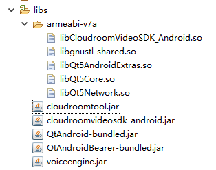
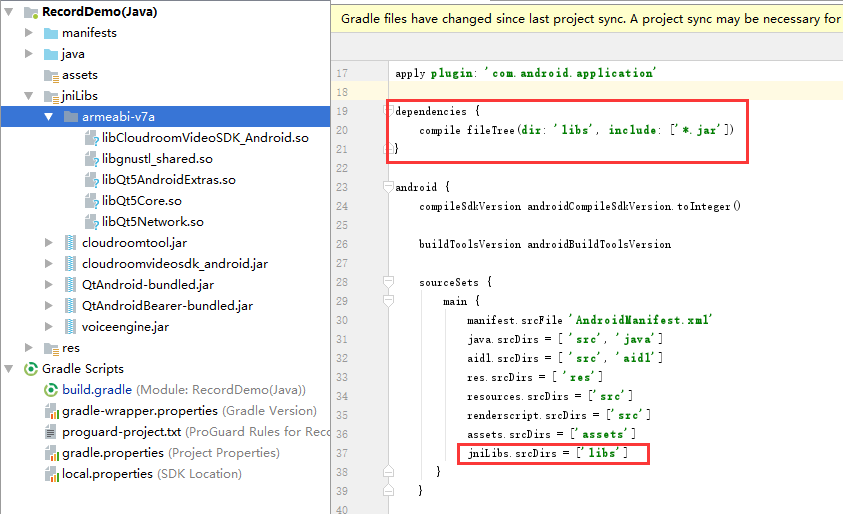

# 云屋视频SDK参考 {#index}

> Java语言接口，适合Android开发APP集成。

    此文档适用v3.6系列版本的SDK
-----

## 说明 {#reference}

> SDK的安装、开发配置和组件介绍。

### SDK开发包内容 {#package}

SDK开发包内容说明：
>     |——readme.txt          sdk包说明文件
>     |——doc                 开发手册、版本历史文件目录
>     |——libs                sdk依赖库的文件目录
>     |——examples            演示程序

### 运行环境要求 {#runEvn}

> * Android 4.1及以上版本的系统

### 开发环境配置 {#developEvn}

> * 添加库到Android工程

> 用Eclipse开发，拷贝SDK包libs目录下的库到工程目录下的libs目录下，结果如下：



> 用Android Studio开发，拷贝拷贝SDK包libs目录到工程目录下，并在build.gradle中配置如下红框中内容：



> * 添加权限声明到AndroidManifest.xml文件

```Java
    <!-- 为了能使用OpenGLES 2.0 API，你必须在你的manifest中添加以下声明： -->
    <uses-feature android:glEsVersion="0x00020000" android:required="true" />
    <!-- 如果你的应用要使用纹理压缩功能，你必须还要声明设备需要支持什么样的压缩格式 -->
    <supports-gl-texture android:name="GL_OES_compressed_ETC1_RGB8_texture" />
    <supports-gl-texture android:name="GL_OES_compressed_paletted_texture" />

    <uses-permission android:name="android.permission.INTERNET" />
    <uses-permission android:name="android.permission.WRITE_EXTERNAL_STORAGE" />
    <uses-permission android:name="android.permission.ACCESS_NETWORK_STATE" />
    <uses-permission android:name="android.permission.RECORD_AUDIO" />
    <uses-permission android:name="android.permission.RECORD_VIDEO" />
    <uses-permission android:name="android.permission.CAMERA" />
    <uses-permission android:name="android.permission.READ_PHONE_STATE" />
    <uses-permission android:name="android.permission.ACCESS_WIFI_STATE" />
    <uses-permission android:name="android.permission.GET_TASKS" />
    <uses-permission android:name="android.permission.WAKE_LOCK" />
    <uses-permission android:name="android.permission.READ_LOGS" />
    <uses-permission android:name="android.permission.MODIFY_AUDIO_SETTINGS" />
    <uses-permission android:name="android.permission.KILL_BACKGROUND_PROCESSES" />
```

> * 添加混淆配置到工程文件proguard-project.txt

```Java

-dontshrink
-dontoptimize
-ignorewarnings
-dontskipnonpubliclibraryclassmembers

-keep class * { native <methods>; }

-keep class com.cloudroom.cloudroomvideosdk.** { *; }
-keep class com.cloudroom.cloudroomvideosdk.model.** { *; }
-keep class com.cloudroom.tool.** { *; }
-keep class com.cloudroom.servicescreencap.** { *; }
-keep class org.webrtc.** { *; }
-keep class org.webrtc.voiceengine.** { *; }
-keep class org.webrtc.webrtcdemo.** { *; }
-keep class org.qtproject.qt5.android.** { *; }
-keep class org.qtproject.qt5.android.bearer.** { *; }
-keep class org.qtproject.qt5.android.accessibility.** { *; }
```

### 主要组件 {#mainClass}

> SDK是由众多的功能组件组合而成的，对外提供以下几个组件：

* [基础组件 CloudroomVideoSDK](#CloudroomVideoSDK)
* [管理组件 CloudroomVideoMgr](#CloudroomVideoMgr)
* [队列组件 CloudroomQueue](#CloudroomQueue)
* [Http文件管理组件 CloudroomHttpFileMgr](#CloudroomHttpFileMgr)
* [视频会议组件 CloudroomVideoMeeting](#CloudroomVideoMeeting)
  * [视频显示组件 VideoUIView](#VideoUIView)
  * [屏幕共享画面显示组件 ScreenShareUIView](#ScreenShareUIView)
  * [影音显示组件 MediaUIView](#MediaUIView)

#### 基础组件CloudroomVideoSDK {#CloudroomVideoSDK}

CloudroomVideoSDK是基础组件，是整个SDK使用的基础。

该组件一个进程内只能创建一个实例，直到应用退出时才反初始化并销毁。

组件使用过程主要包括：

    1. 创建组件实例
    2. 执行初始化
    3. 程序退出时执行反初始化

#### 管理组件CloudroomVideoMgr {#CloudroomVideoMgr}

CloudroomVideoMgr是登录、呼叫、会议创建管理和透明传输类。

该组件一个进程内只能创建一个实例，实现了入会前的相关功能。

组件使用过程主要包括：

    1. 创建组件实例
    2. 登录
    3. 创建会议

注意: 只有在CloudroomVideoSDK Init初始化成功后接口才可用。

#### 队列组件CloudroomQueue {#CloudroomQueue}

CloudroomQueue是队列组件，它实现队列功能。

该组件一个进程内只能创建一个实例，是可选组件，用于用户分发，您可以使用它，也可以自已另外实现，这并不影响视频呼叫、音视频通话功能。

组件使用过程主要包括：

    1. 创建组件实例，执行初始化
    2. 队列获取，客户排队/座席服务

注意：只有在CloudroomVideoMgr登录成功后接口才可用。

#### Http文件管理组件CloudroomHttpFileMgr {#CloudroomHttpFileMgr}

CloudroomHttpFileMgr是Http文件上传下载及文件管理类。

该组件一个进程内只能创建一个实例，主要应用于单方文件归档，单方文件下载，支持非云屋http服务器对接。

如果会议内临时文件共享，请使用CloudroomVideoMeeting中的会议网盘功能。

下载支持断点续传，上传暂不支持断点机制。

注意：只有在CloudroomVideoSDK初始化后接口才可用。

#### 视频会议组件CloudroomVideoMeeting {#CloudroomVideoMeeting}

CloudroomVideoMeeting是视频会议类。

该组件一个进程内只能创建一个实例，包含了视频会话相关的全部功能。

组件使用过程主要包括：

    1. 创建组件实例
    2. 进入会议
    3. 会议内的各功能处理
    4. 退出会议

注意：只有在CloudroomVideoSDK Init初始化成功后接口才可用。

进入视频会议可用以下组件：

##### 视频显示组件VideoUIView {#VideoUIView}

VideoUIView是视频显示组件，它显示设定的用户的视频。

该组件可以创建多个实例，然后分别配置大小、位置并设置要显示的用户ID和摄像头ID即可。

注意：只有在CloudroomVideoMeeting入会成功后才能正常工作。

##### 屏幕共享画面显示组件ScreenShareUIView {#ScreenShareUIView}

  ScreenShareUIView是屏幕共享显示组件，它用于显示会议内对方共享的屏幕图像。

  该组件整个程序内建议只创建一个实例，用来接受显示他人开启共享后传过来的画面。

  注意：只有在CloudroomVideoMeeting入会成功后才能正常工作。

##### 影音显示组件MediaUIView {#MediaUIView}

MediaUIView是影音显示组件，它用于显示自己或者对方会议内播放的影音图像和声音。

该组件整个程序内建议只创建一个实例，影音控制接口由CloudroomVideoMeeting统一提供。

注意：只有在CloudroomVideoMeeting入会成功后才能正常工作。


[回到索引](#mainClass)
