# Demo程序介绍 {#demo}

> Examples 目录下Demo程序配置和功能简介。

----

## 视频会议 {#Meeting}

> Java编写，主要实现了创建进入视频会议，用会议号进入视频会议，会议内视频墙、屏幕共享、视频设置、IM聊天等功能。

* 导入Demo工程到IDE中

> 使用Eclipse为开发工具：导入Meeting(Java)工程到Eclipse中；

> 使用Android Studio为开发工具：打开Meeting(Java)下的build.gradle工程文件；

* 电脑连接手机并运行程序到手机上

* 输入服务器地址和用户ID，登录（可以是自建服务器地址，也可以使用云屋公有地址）

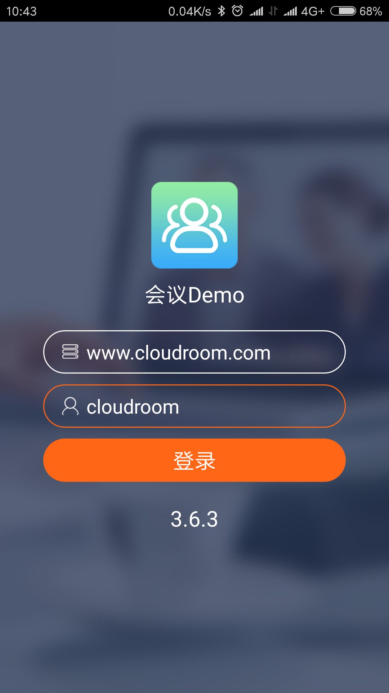

* 输入会议主题，创建并进入会议（输入会议号进入会议）

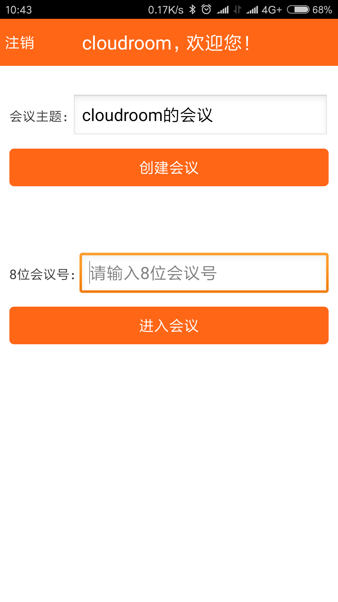

* 进入视频会议主界面

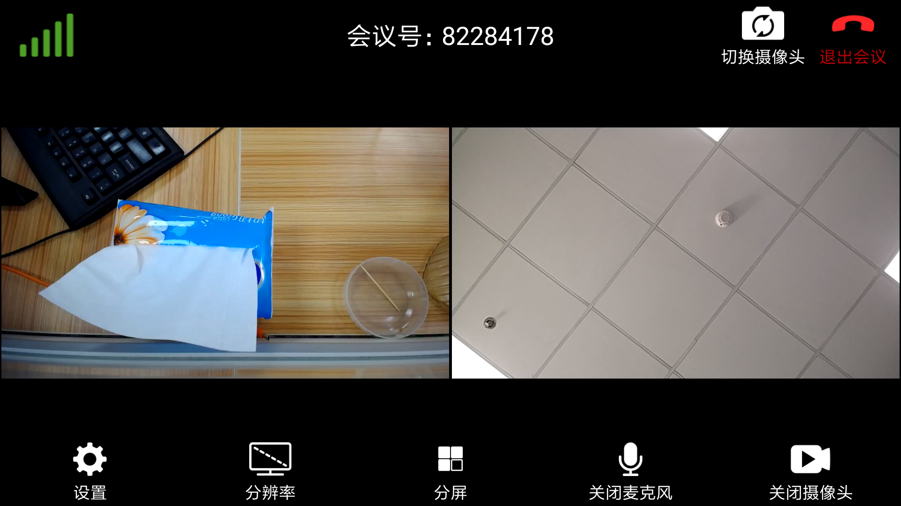

## 队列呼叫 {#VideoCall}

> Java编写，主要实现了利用队列系统进行用户分配，然后呼叫分到的用户，双方进入同一个视频会话中等功能。

* 导入Demo工程到IDE中

> 使用Eclipse为开发工具：导入VideoCall(Java)工程到Eclipse中；

> 使用Android Studio为开发工具：打开VideoCall(Java)下的build.gradle工程文件；

* 电脑连接手机并运行程序到手机上

* 输入服务器地址和用户ID（可以是自建服务器地址，也可以使用云屋公有地址）, 选择角色，登录

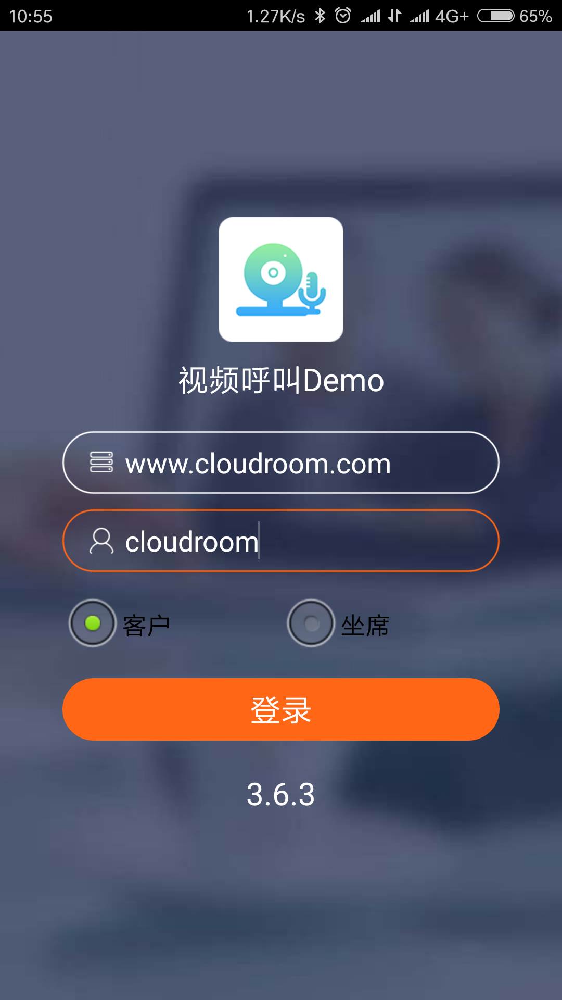

* 进入队列主界面，坐席可同时开始服务若干队列，客户每次则只能选择一个队列进行排队

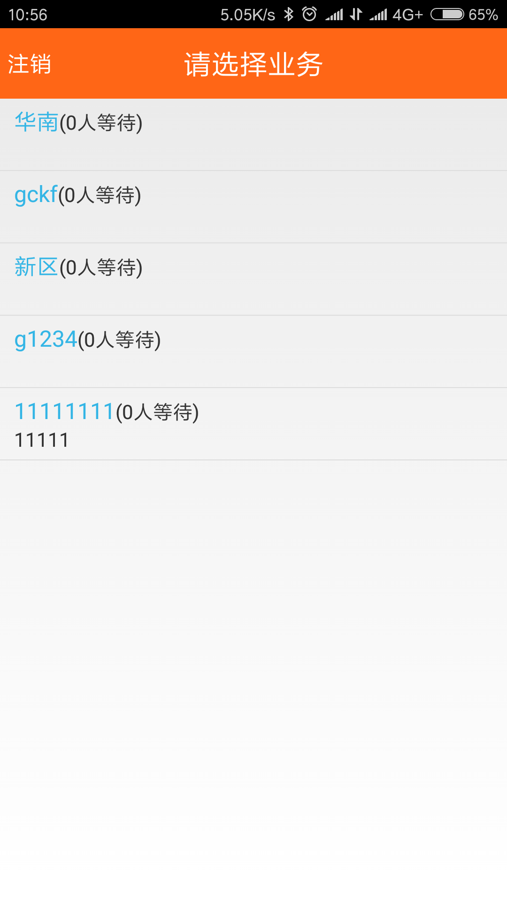
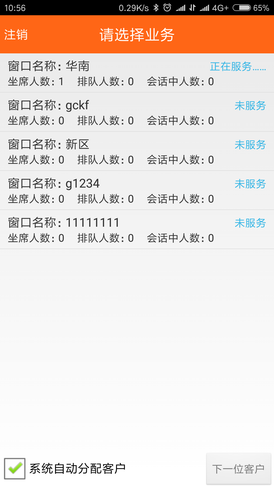

* 客户选择某个服务排队、坐席收到队列系统分配的排队用户

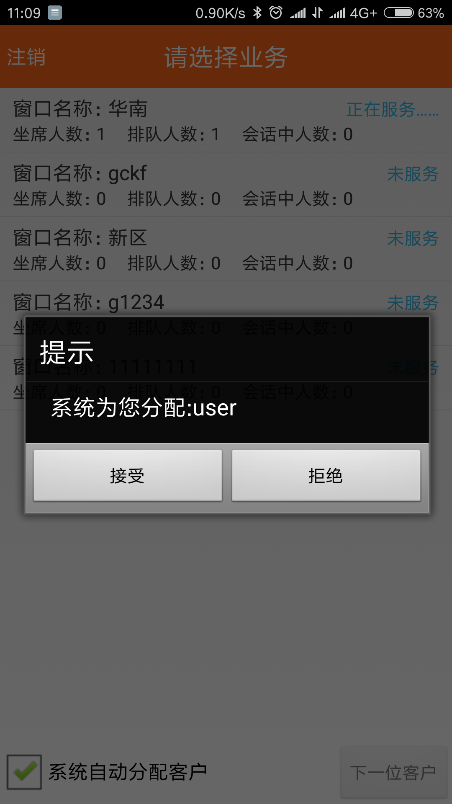

* 接受分配的用户即可进入视频会话中

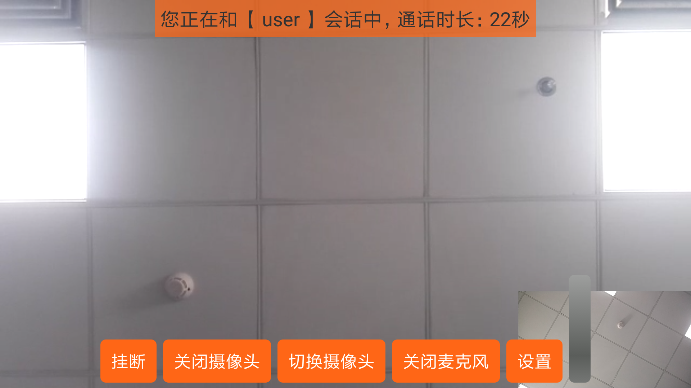

## 金融合规双录 {#RecordDemo}

> Java编写，主要实现了录制本地音视频并上传等功能。

* 导入Demo工程到IDE中

> 使用Eclipse为开发工具：导入RecordDemo(Java)工程到Eclipse中；

> 使用Android Studio为开发工具：打开RecordDemo(Java)下的build.gradle工程文件；

* 电脑连接手机并运行程序到手机上

* 输入服务器地址和用户ID，登录（可以是自建服务器地址，也可以使用云屋公有地址）

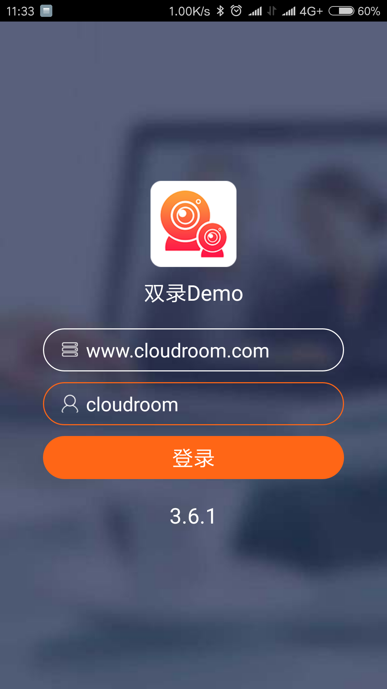

* 登录选择业务，选择服务类型

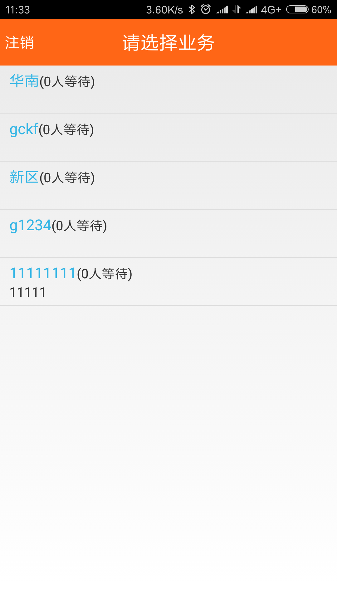
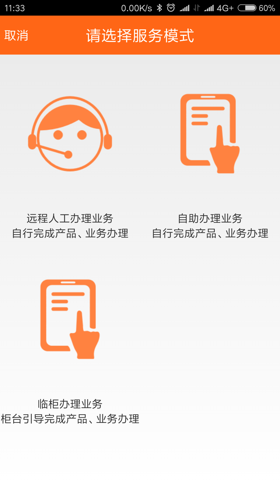

* 进入程序主界面

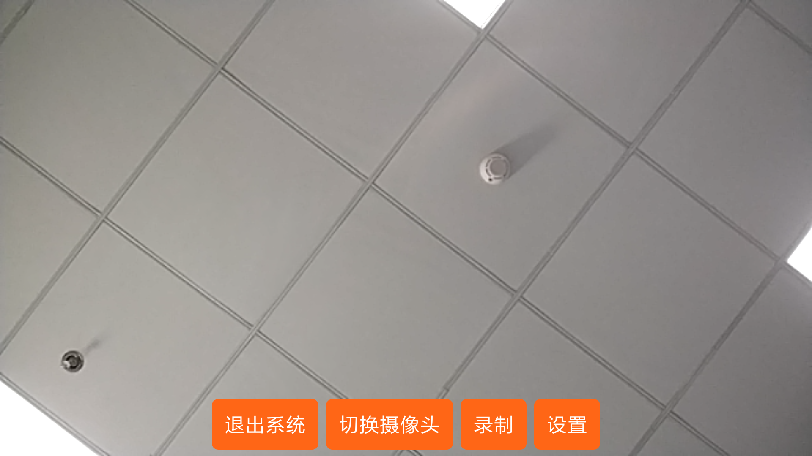