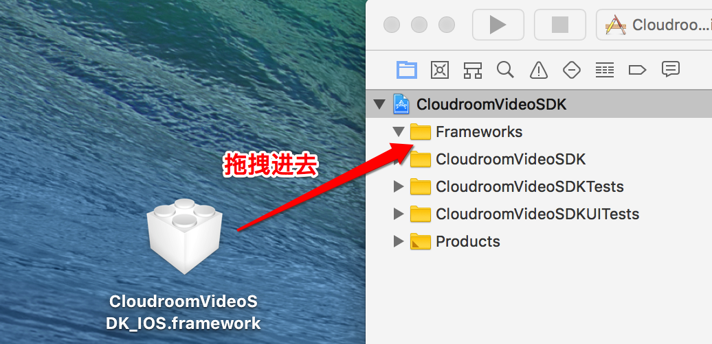
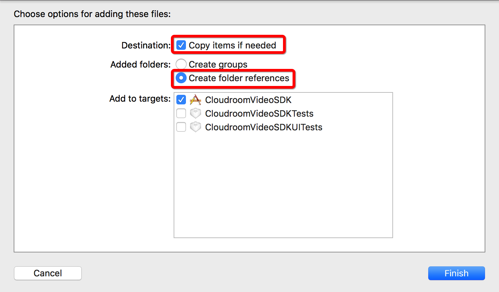
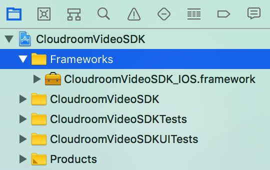
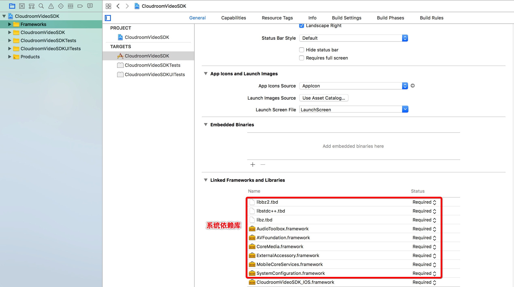
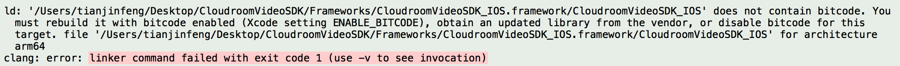
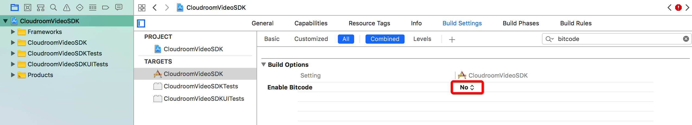
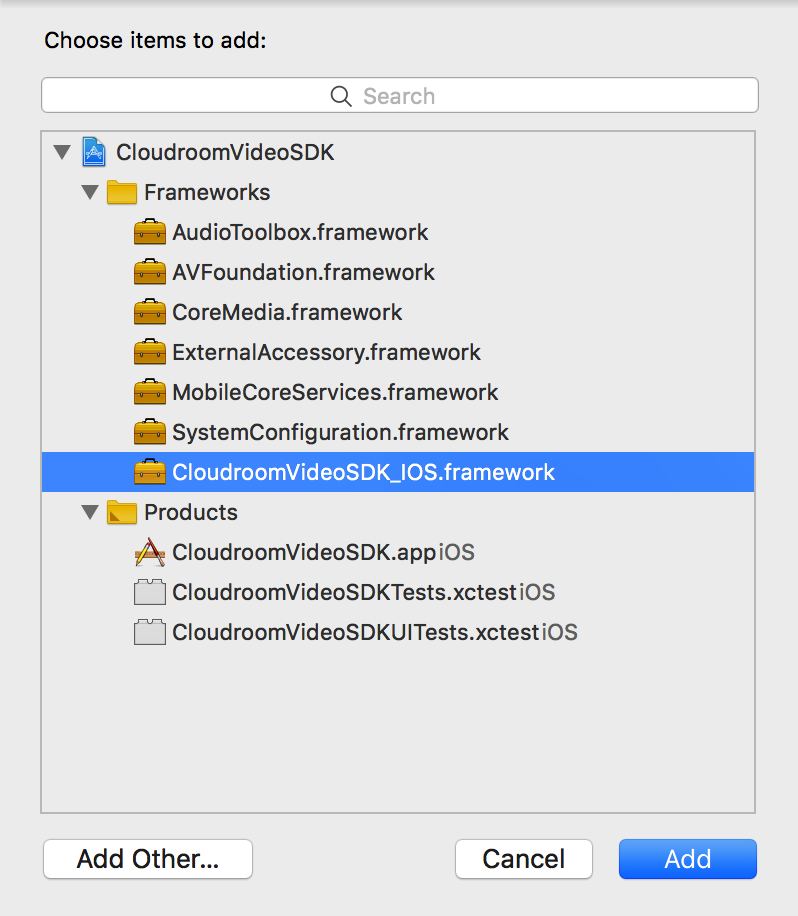
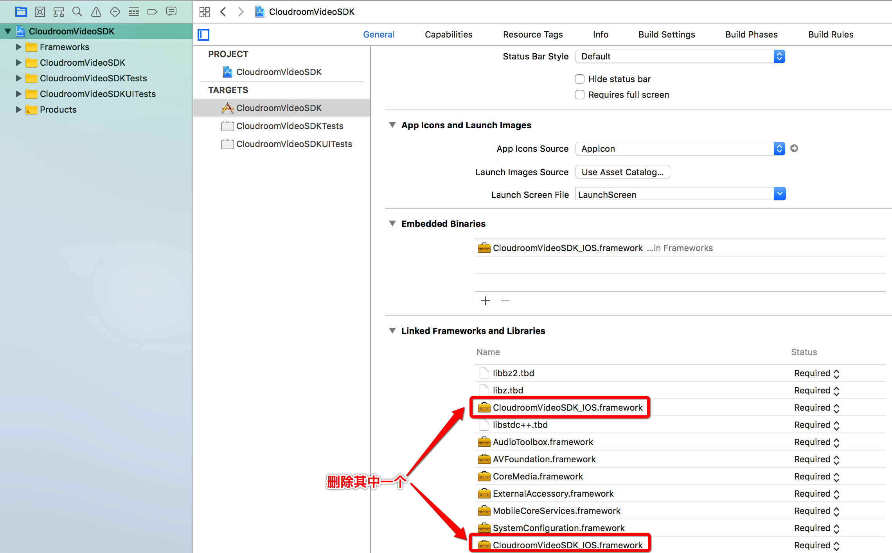
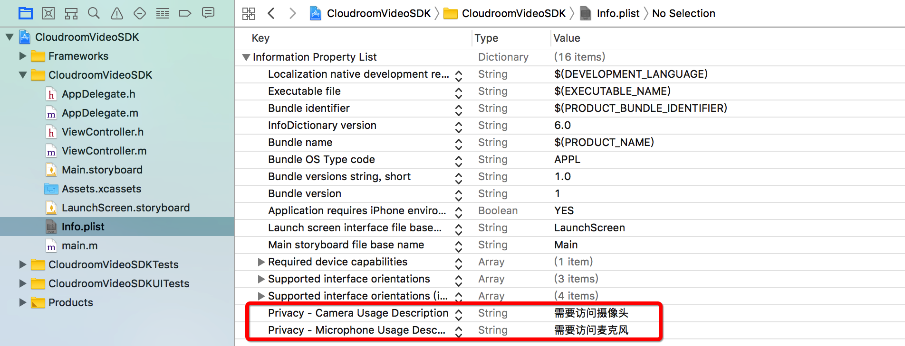

# 云屋视频SDK参考 {#index}

    此文档适用v3.6系列版本的SDK
-----

## 说明 {#reference}

> SDK的安装、开发配置和组件介绍

### SDK安装 {#install}

SDK开发包内容说明:
>     |——ReadMe.txt          SDK 包说明文件
>     |——doc                 开发手册
>     |——Framework           SDK 动态库
>     |——Examples            演示程序

### 运行环境要求 {#runEnv}

> * Xcode8 以后，iOS8 以上

### 开发环境配置 {#developEnv}

> * 在项目中创建一个目录`Frameworks`(方便以后库管理):

> * 将动态库`CloudroomVideoSDK_IOS.framework`添加到项目中:

> * 添加系统依赖库:

#### 常见问题 {#problems}
> * bitcode

问题:

解决方案:

> * image not found

问题:

解决方案:

> * 权限问题

### 主要组件 {#mainClass}

> SDK 是以动态库的形式呈现，对外提供以下几个组件:

* [基础组件 CloudroomVideoSDK](#CloudroomVideoSDK)
* [管理组件 CloudroomVideoMgr](#CloudroomVideoMgr)
* [队列组件 CloudroomQueue](#CloudroomQueue)
* [Http文件管理组件 CloudroomHttpFileMgr](#CloudroomHttpFileMgr)
* [视频会议组件 CloudroomVideoMeeting](#CloudroomVideoMeeting)

#### 基础组件CloudroomVideoSDK {#CloudroomVideoSDK}

CloudroomVideoSDK是基础组件，是整个SDK使用的基础。

该组件一个进程内只能创建一个实例，直到应用退出时才反初始化并销毁。

组件使用过程主要包括:

    1. 创建组件实例
    2. 执行初始化
    3. 程序退出时执行反初始化

#### 管理组件CloudroomVideoMgr {#CloudroomVideoMgr}

CloudroomVideoMgr是登录、呼叫、会议创建管理和透明传输类。

该组件一个进程内只能创建一个实例，实现了入会前的相关功能。

组件使用过程主要包括:

    1. 创建组件实例
    2. 登录
    3. 创建会议

注意: 只有在CloudroomVideoSDK initSDK 初始化成功后接口才可用。

#### 队列组件CloudroomQueue {#CloudroomQueue}

CloudroomQueue是队列组件，它实现队列功能。

该组件一个进程内只能创建一个实例，是可选组件，用于用户分发，您可以使用它，也可以自已另外实现，这并不影响视频呼叫、音视频通话功能。

组件使用过程主要包括:

    1. 创建组件实例，执行初始化
    2. 队列获取，客户排队/座席服务

注意:只有在 CloudroomVideoMgr 登录成功后接口才可用。

#### Http文件管理组件CloudroomHttpFileMgr {#CloudroomHttpFileMgr}

CloudroomHttpFileMgr 是 Http 文件上传下载及管理类。

该组件一个进程内只能创建一个实例，主要应用于单方文件归档，单方文件下载，支持非云屋http服务器对接。

如果会议内临时文件共享，请使用CloudroomVideoMeeting中的会议网盘功能。

下载支持断点续传，上传暂不支持断点机制。

注意:只有在 CloudroomVideoSDK initSDK 初始化后接口才可用。

#### 视频会议组件CloudroomVideoMeeting {#CloudroomVideoMeeting}

CloudroomVideoMeeting是视频会议类。

该组件一个进程内只能创建一个实例，包含了视频会话相关的全部功能。

组件使用过程主要包括:

    1. 创建组件实例
    2. 进入会议
    3. 会议内的各功能处理
    4. 退出会议

注意:只有在 CloudroomVideoSDK initSDK 初始化成功后接口才可用。

[回到索引](#mainClass)