# Demo程序介绍 {#demo}

> Examples 目录下 demo 程序功能简介。

----

## 视频会议 {#Meeting}

> Objective-C 编写，主要实现了透明传输，创建进入视频会议，用会议号进入视频会议，会议内视频墙、屏幕共享、音视频设置等功能。

* 用 Xcode 打开 SDK 开发包内项目文件

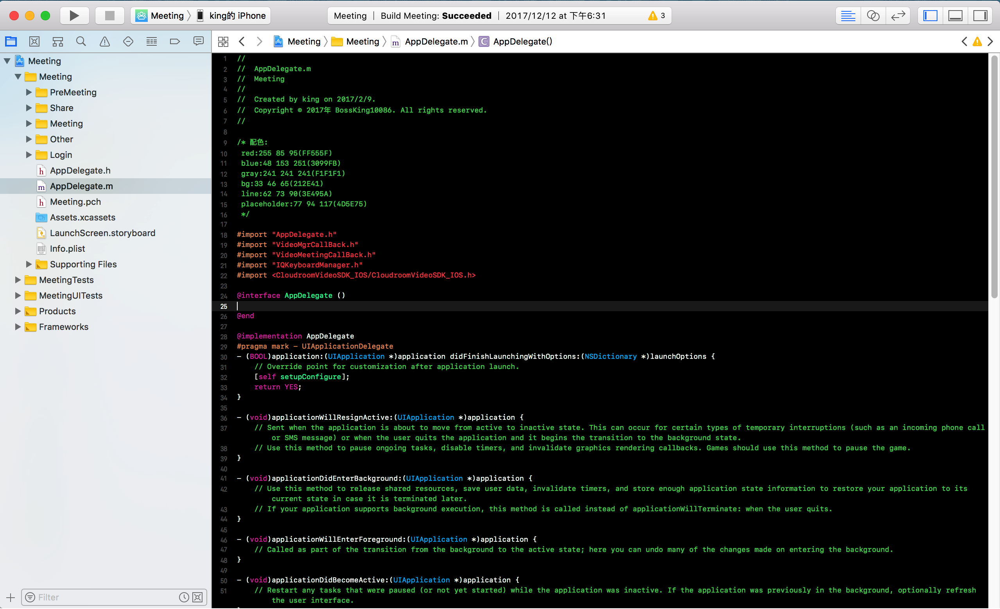

* 输入服务器地址和用户 ID，登录

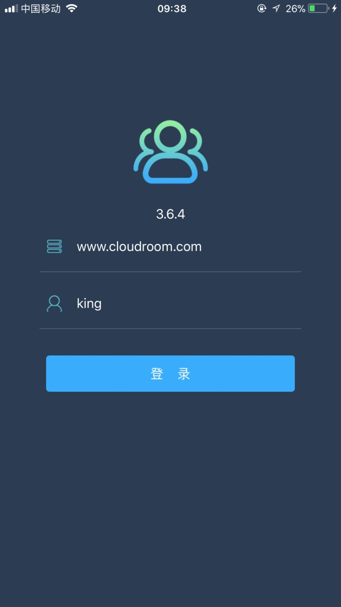

* 输入会议主题，创建并进入会议

* 进入视频会议主界面

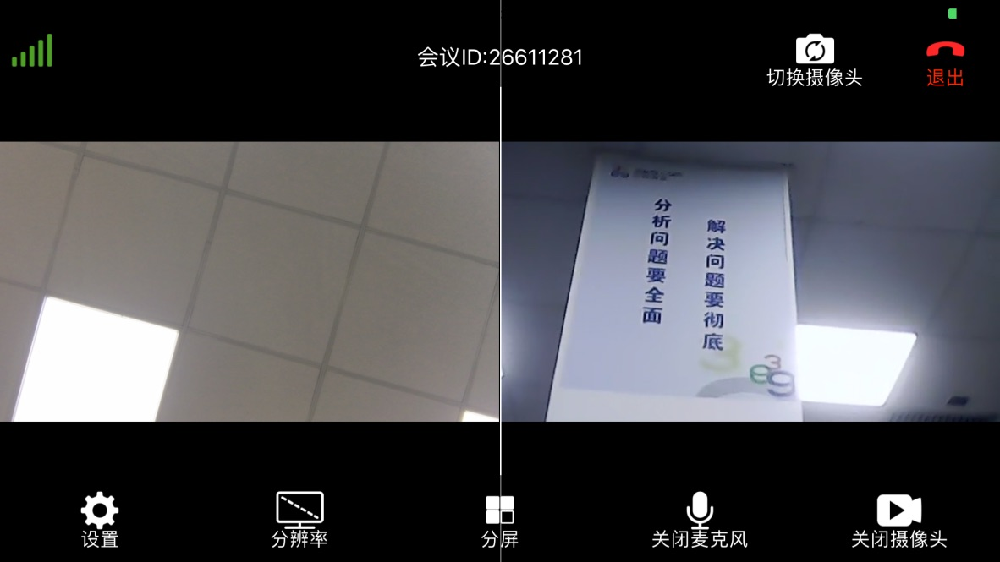

## 队列呼叫 {#VideoCall}

> Objective-C 编写，主要实现了利用队列系统进行用户分配，然后呼叫分到的用户，双方进入同一个视频会话中等功能。

* 用 Xcode 打开 SDK 开发包内项目文件

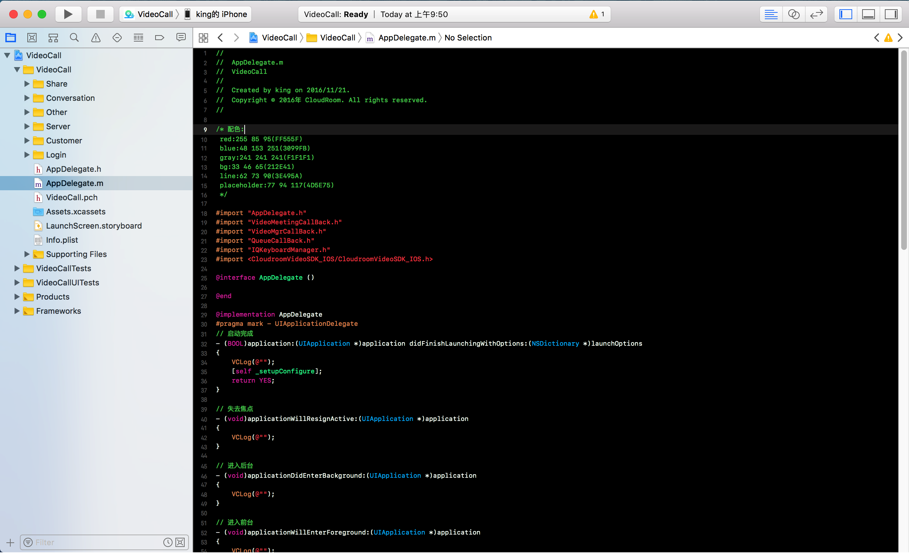

* 编译后在两台机器上分别运行，输入服务器地址（可以是自建服务器地址，也可以使用云屋公有地址），用户 ID，选择角色，登录

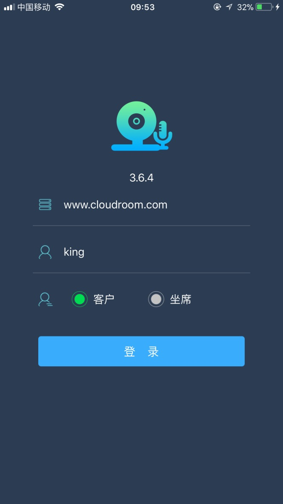

* 进入队列主界面，坐席可同时开始服务若干队列，客户每次则只能选择一个队列进行排队

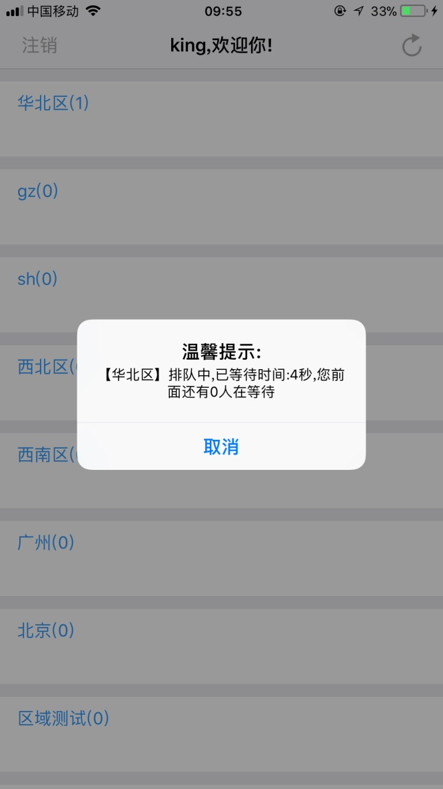

* 坐席收到队列系统分配的排队用户

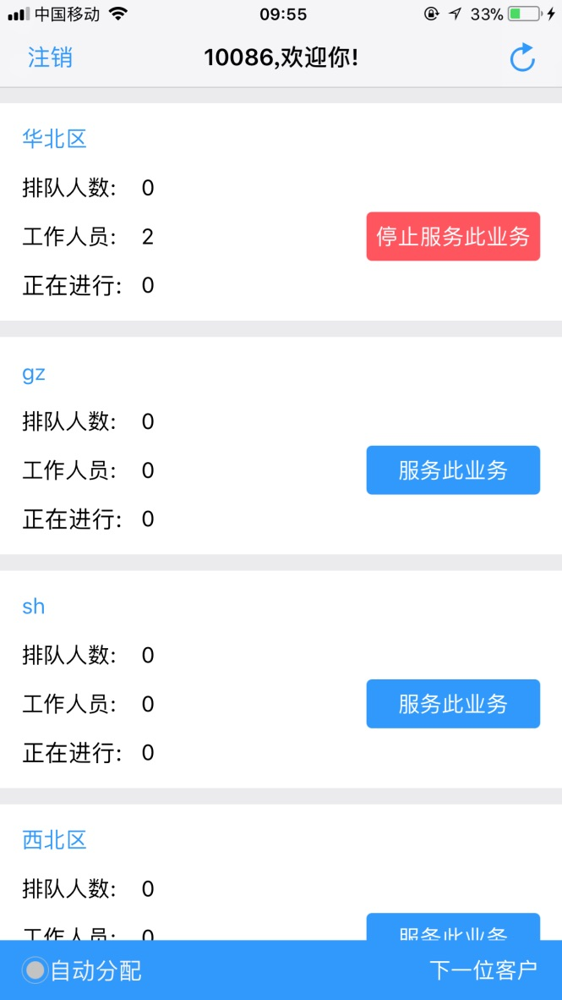
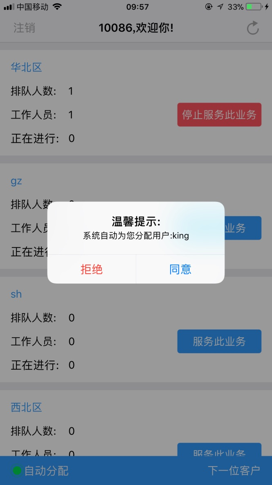

* 接受分配的用户即可进入视频会话中

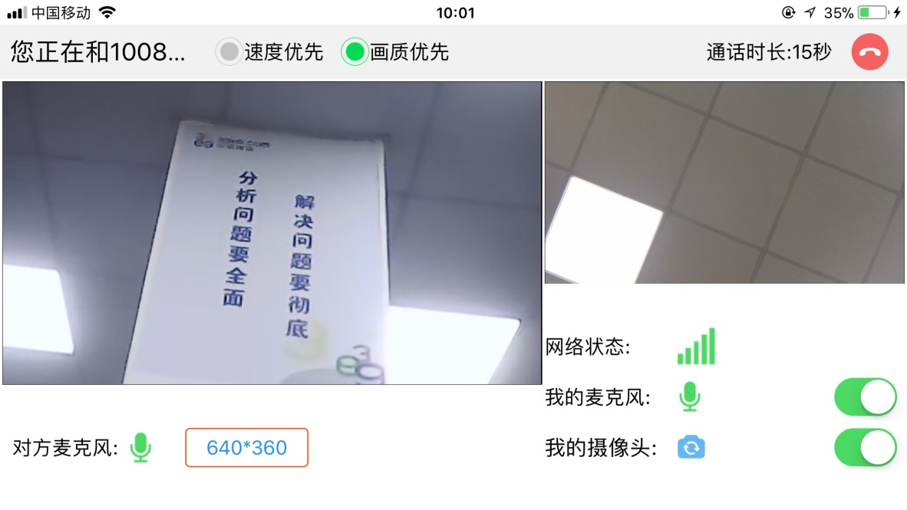

## 金融合规双录 {#RecordDemo}

> Objective-C 编写，主要实现了录制本地音视频并上传等功能。

* 用 Xcode 打开 SDK 开发包内项目文件

* 编译运行，输入服务器地址（可以是自建服务器地址，也可以使用云屋公有地址），用户 ID

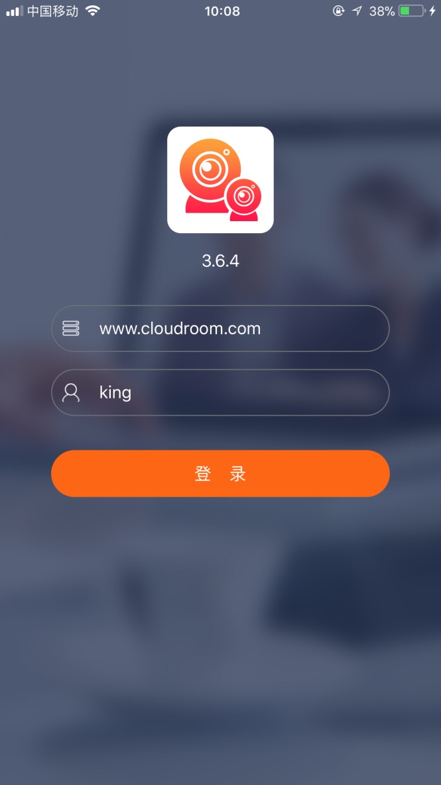

* 登录，进入程序主界面

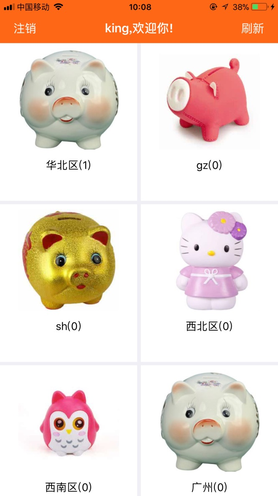

* 选择远程双录功能

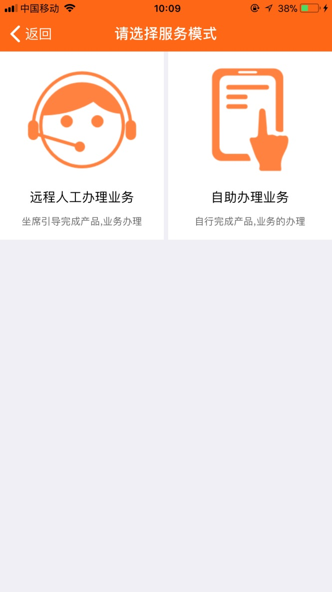

* 进入队列主界面，客户每次则只能选择一个队列进行排队

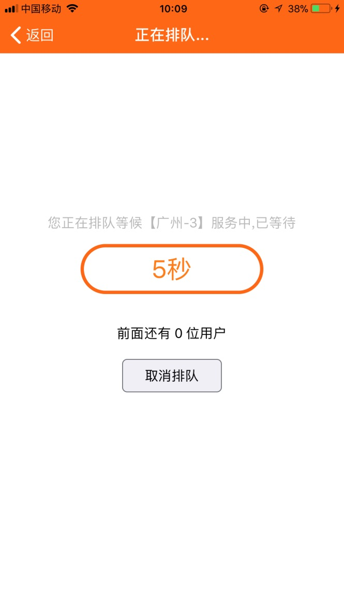

* 进入视频会话主界面

> 竖屏:

> 横屏:

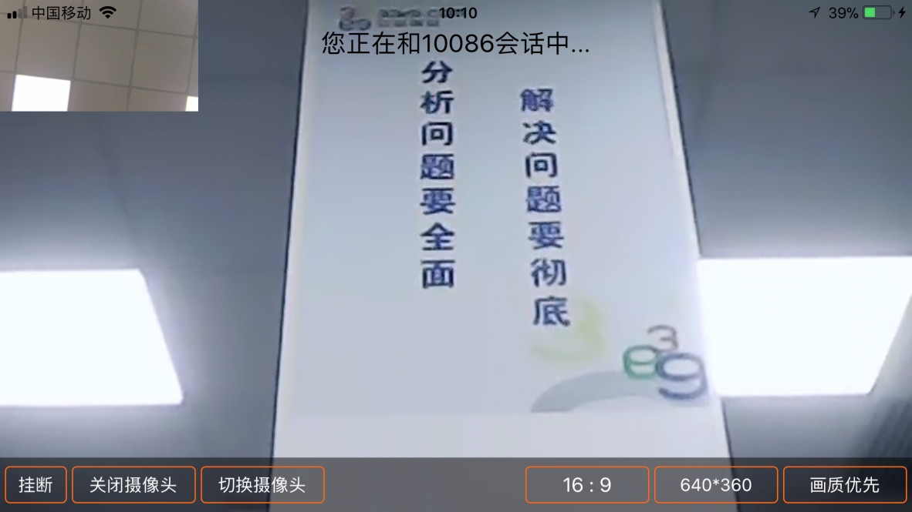
